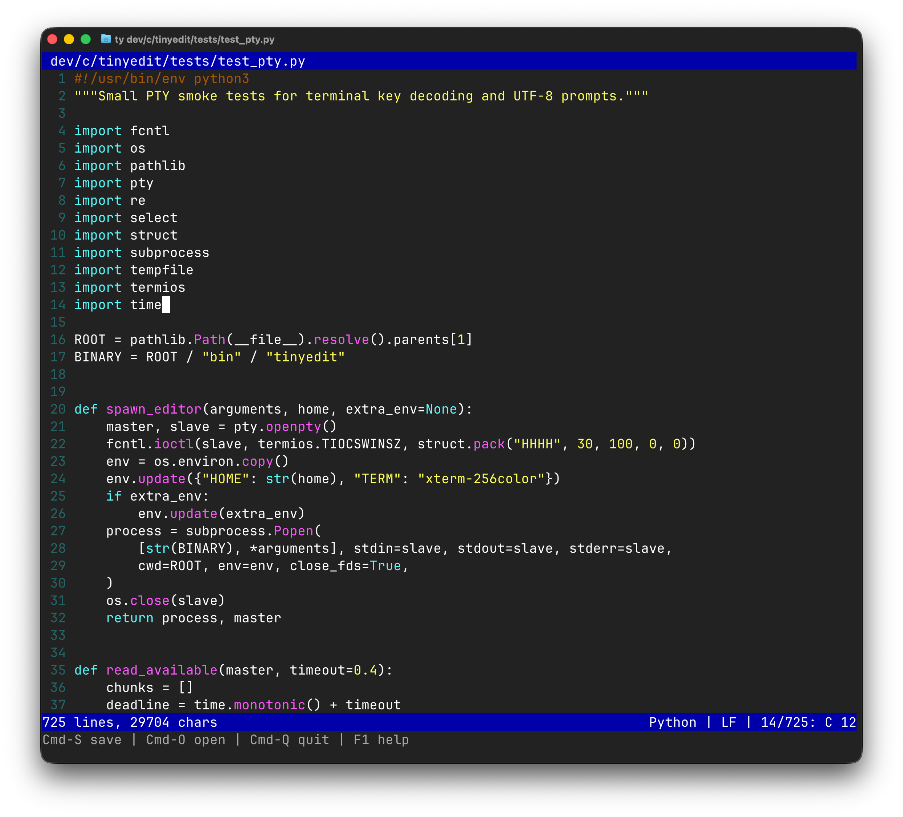
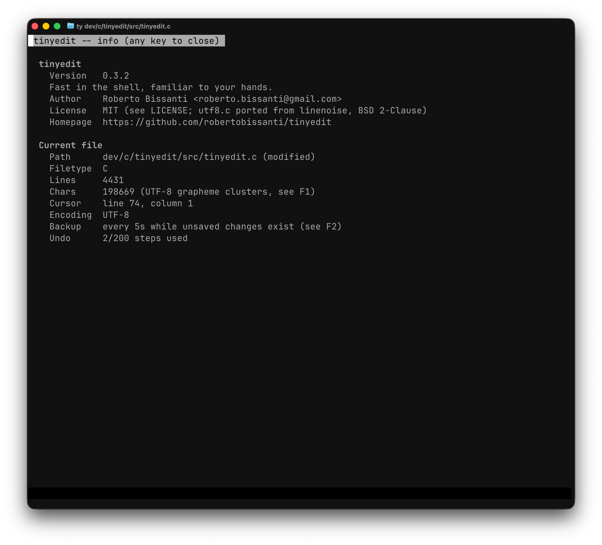
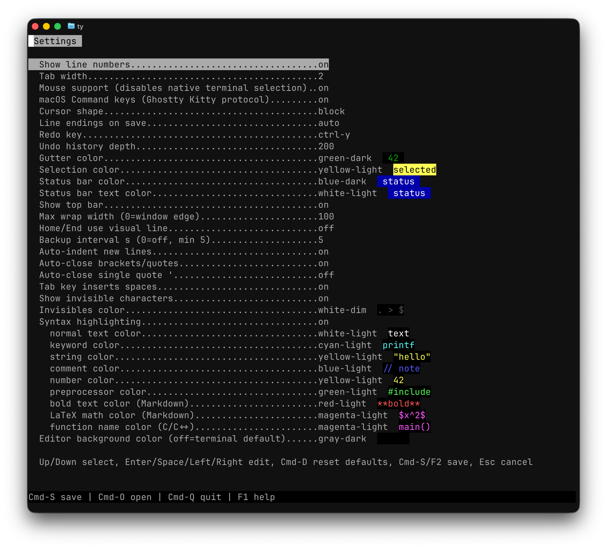
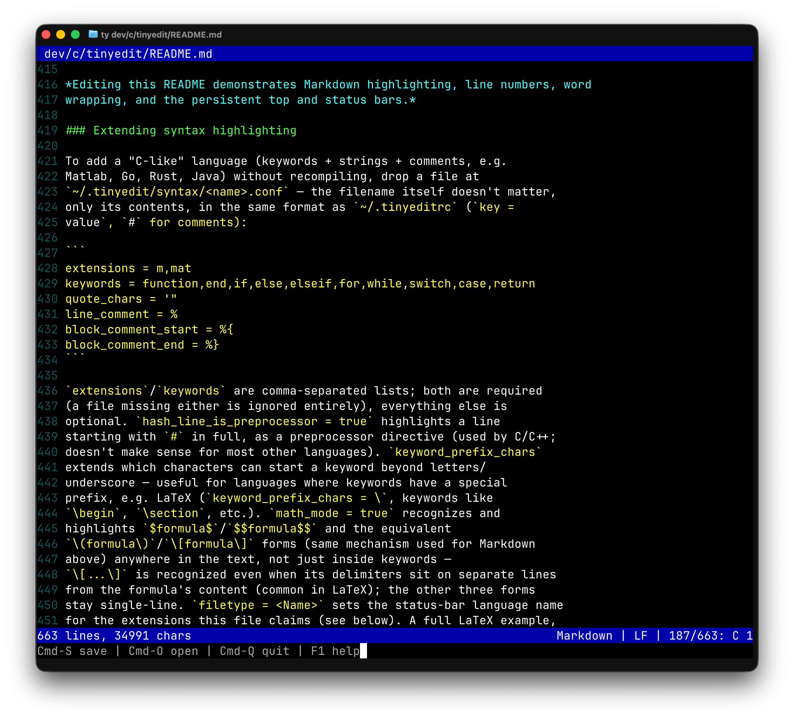
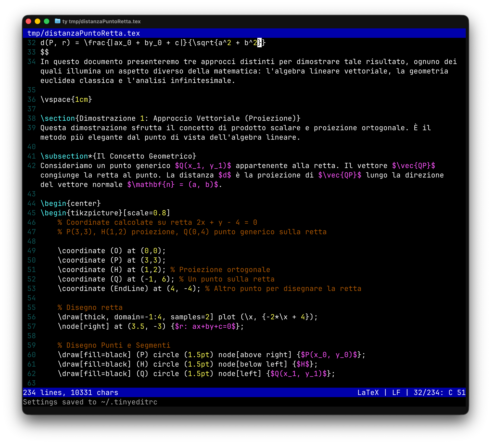
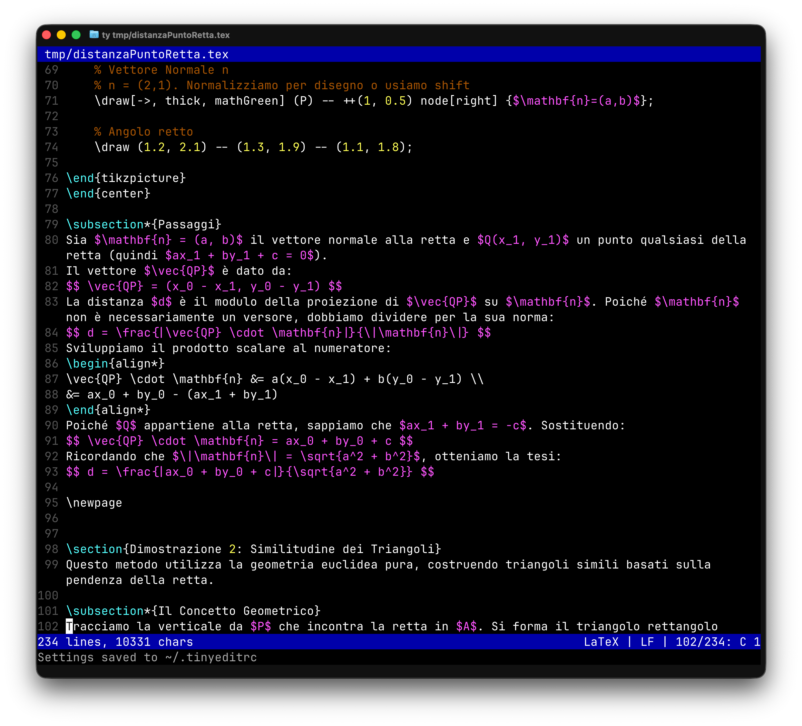

# tinyedit

[](https://github.com/robertobissanti/tinyedit/releases)
[](LICENSE)
[](https://github.com/robertobissanti/tinyedit)
[](https://github.com/robertobissanti/tinyedit)

A small full-screen terminal text editor written in plain C (kilo-style,
after [kilo](https://github.com/antirez/kilo) by Salvatore Sanfilippo),
with no dependencies beyond the POSIX standard library.

tinyedit aims to bring the familiar ease of a desktop text editor to the
terminal. It deliberately avoids the legacy of modes, commands, and unusual
key combinations associated with editors such as Vim, Nano, or Emacs. Those
programs are powerful and useful, but their interaction models can feel more
complex than the everyday editing many people expect from a modern desktop
application.

## Why it exists

I kept building tinyedit because I became convinced that a terminal editor
could be simple enough to use every day. While implementing it, I paid close
attention to carrying over the mouse gestures and keyboard shortcuts people
already know from desktop text editors and word processors. The goal is not
to invent another editing language: it is to make opening a terminal file
feel immediately familiar.

There is still plenty to implement. Multiple buffers, for example, would make
it possible to keep several files open in one session. Any such addition must
earn its place, though—the program should grow without losing the simplicity
that motivated it in the first place.



*Python source in tinyedit, with line numbers, soft wrapping, file statistics,
and configurable syntax colors.*

## Features at a glance

tinyedit is intentionally small, but it is meant to be comfortable enough
for real editing rather than just demonstrating how a terminal works.

| Area | What you get |
|---|---|
| Editing | Familiar cursor movement, word jumps, selection, cut/copy/paste, automatic indentation, block indent/outdent with Tab, configurable pair closing, and an undo history of up to 2,000 steps (200 by default). |
| Files | Open or switch files without restarting tinyedit, start a named file before it exists, save atomically, and recover unsaved work from automatic backups after a crash. |
| Search | Incremental literal or POSIX regular-expression search, match navigation, and interactive search and replace. |
| Syntax highlighting | Built-in support for C/C++, Python, Shell, JavaScript/TypeScript, Markdown, HTML/XML, and CSS, including function names. Simple C-like languages can be added with a user configuration file. |
| UTF-8 | Cursor movement, deletion, display width, wrapping, and character counts understand combining marks, CJK text, and multi-code-point emoji. |
| Long lines | Lines wrap at the terminal edge, preferably at word boundaries. Navigation follows the visible wrapped rows, without imposing a fixed line-length limit. |
| Clipboard | Uses the native macOS clipboard or the available Wayland/X11 clipboard tool directly, without sending commands through a shell. |
| Terminal input | Fast bracketed paste, optional mouse selection and scrolling, and key-sequence handling for common macOS and Linux terminals. |
| Interface | Optional line numbers and top bar, visible whitespace, file statistics, in-editor help, and a persistent settings panel. |
| Configuration | Settings live in `~/.tinyeditrc`; colors, tabs, wrapping, mouse behavior, interface elements, and editing assists can all be changed from `F2`. |
| Portability | One C99 binary and no third-party runtime libraries. The supported targets are POSIX systems such as macOS and Linux. |
| Testing | Syntax, settings, backup, terminal-input, key-binding, and very-long-line behavior are covered by `make test`; sample files are included for hands-on checks. |

Settings can be changed from the built-in `F2` panel or by editing
`~/.tinyeditrc`, which tinyedit creates automatically on first launch.

The project also remains an exploration of how terminal interfaces work from
scratch: raw mode, ANSI escape sequences, input decoding, and manual redraw,
without reaching for a TUI framework. Its first prototype used
[linenoise](https://github.com/antirez/linenoise) for a command-driven line
editor. The current version is a true full-screen editor with a freely moving
cursor; linenoise remains in the repository for historical reference but is
not a build dependency.

## Build

```sh
make        # produces the ./tinyedit binary
make clean  # removes it
```

Needs only a C99 compiler and a POSIX system (macOS or Linux).

## Usage

```sh
./tinyedit [file]
```

### Keyboard shortcuts

| Key | Action |
|---|---|
| Arrows, Home, End, PageUp/Down | Move cursor |
| `Ctrl+Home` / `Ctrl+End` (or `Ctrl+PageUp` / `Ctrl+PageDown`) | Jump to the start/end of the file |
| `Alt+←` / `Alt+→` (or `Esc b` / `Esc f`) | Jump by word |
| `Shift+Arrows` / `Shift+PageUp` / `Shift+PageDown` / `Shift+Home` / `Shift+End` | Extend/start text selection (doesn't work on macOS Terminal.app — use `Ctrl-T` instead) |
| `Ctrl-T` | Toggle selection mode: while on, plain arrows, PageUp/PageDown and Home/End extend the selection the way Shift would — works on every terminal, including Terminal.app |
| Enter | New line (inherits the previous line's indentation if `auto_indent` is on) |
| Tab | Indent (spaces or a literal tab, see `insert_spaces_for_tab`); with a selection, indents every selected line one level |
| `Shift+Tab` | Outdent the selected lines, or the current one when there's no selection |
| `(` `{` `[` `"` `` ` `` `$` | Auto-close the pair / skip over an existing closer / wrap the selection (if `auto_close_pairs` is on) |
| `'` | Same, but only when `auto_close_single_quote` is on (off by default, since apostrophes in prose are more common than pairs) |
| Backspace / Delete | Delete a character (UTF-8 aware) |
| `Ctrl-A` | Select all |
| `Ctrl-C` / `Ctrl-X` / `Ctrl-V` | Copy / cut / paste (system clipboard; C/X need an active selection) |
| `Ctrl-Z` | Undo |
| `Ctrl-Y` | Redo |
| `Ctrl-F` | Incremental search (Arrows for next/previous match, `Ctrl-G` to toggle regex search, `Ctrl-R` to switch to search & replace, Esc to cancel) |
| `F1` | Help screen listing every shortcut (any key closes it) |
| `F3` | Info screen: version, author, and stats about the current file |
| `F2` | Settings panel (Up/Down to navigate, Enter/Space to edit, Left/Right to cycle a multiple-choice value back/forward, `Ctrl-D` resets to defaults, `Ctrl-S` saves and exits, Esc exits — asks for confirmation if there are unsaved changes) |
| `Ctrl-S` | Save (asks for a filename if none is set) |
| `F4` (or `Ctrl-Shift-S` where the terminal sends it) | Save as: always asks for a filename, even when one is already set |
| `Ctrl-O` | Open another file by entering its path; offers to save the current file first. A missing path becomes a new file on first save. |
| `Ctrl-W` | Close the current file without quitting tinyedit; offers to save first and leaves an empty buffer. |
| `Ctrl-Q` | Quit (if there are unsaved changes, asks y/n/Esc: save-and-quit / quit without saving / cancel) |

### Opening and closing files

tinyedit keeps one active document at a time, but changing files does not
require restarting the program. `Ctrl-W` closes the current document and
returns to an empty unnamed buffer. `Ctrl-O` asks for a path and replaces the
current document with that file. Before either operation, unsaved changes get
the same save/discard/cancel check used by `Ctrl-Q`; cancelling or failing to
save leaves the current document untouched. If the path entered for `Ctrl-O`
does not exist, tinyedit opens an empty buffer under that name and creates the
file when it is first saved.

### File information



*The `F3` screen summarizes the program version and the current file without
leaving the editor.*

### Fast terminal paste

Pasting text directly into the terminal (Cmd+V or right-click, not
just the editor's own `Ctrl-V` which reads the system clipboard) is
handled via [bracketed
paste](https://en.wikipedia.org/wiki/Bracketed-paste): pasted text is
inserted in one shot instead of character by character, so it's
instant even for thousands of lines, and it doesn't trigger auto-close
on parentheses/quotes/backticks that happen to be in the pasted text
(which would otherwise be treated as if the user had typed them one at
a time). This needs terminal support for the protocol — virtually
every modern terminal has it, including Ghostty, iTerm2, and
Terminal.app; if you're running inside `tmux`/`screen` and paste still
feels slow, check that it's passed through there too.

### Mouse support

Mouse support (`mouse_enabled`, F2 panel, **off by default**) lets you
click to place the cursor, drag with the left button to select text,
and scroll with the wheel. It's opt-in because, once enabled, it takes
over the terminal's own native selection (e.g. Cmd+C/Cmd+V on Ghostty)
— the terminal hands mouse events to tinyedit instead of handling them
itself for as long as the setting stays on. The change takes effect
immediately: toggling it in `F2` and pressing `Ctrl-S` applies it
right away, no restart needed.

### Settings and appearance

Line numbers (gutter), tab width, the redo key, interface colors,
soft-wrap, the top bar, auto-indent, auto-close pairs, tabs-as-spaces,
and invisible characters are all configurable from the `F2` panel and
saved to `~/.tinyeditrc` — see the file itself (generated
automatically on first launch if it doesn't already exist) for the
exact format. Inside `F2`, `Ctrl-D` resets every setting back to its
default (still needs `Ctrl-S` to actually take effect). Upgrading
tinyedit never requires touching an existing `~/.tinyeditrc`: keys
that aren't in the file (because they were introduced by a newer
version) simply stay at their default until set explicitly.



*The built-in `F2` panel exposes the same options stored in `~/.tinyeditrc`,
including undo depth, wrapping, backup, colors, and mouse support.*

### Indentation and tabs

With `auto_indent` on (default), Enter copies the leading
whitespace of the line you're moving away from, so continuing to type
keeps the same indentation level without retyping it by hand. With
`insert_spaces_for_tab` on (default), the Tab key inserts `tab_stop`
spaces instead of a literal tab character.

With an active selection, Tab indents every selected line one level and
`Shift+Tab` outdents them; with no selection, `Shift+Tab` outdents the
current line. Each press is a single undo step, and the selection stays
put afterwards so the shortcut can be repeated. Outdent accepts
whatever indentation the file already uses rather than only the flavor
tinyedit would produce: a leading tab counts as one full level,
otherwise up to `tab_stop` spaces are removed, stopping at the first
non-space so a partially indented line only loses what it has.

### Automatic pair closing

With `auto_close_pairs` on (default), typing `(`, `{`, `[`, `"`,
`` ` ``, or `$` inserts the matching closing character automatically
with the cursor left in between; typing the closer by hand when the
next character is already that closer skips over it instead of
duplicating it (except for `` ` ``, see below); with an active text
selection, typing an opening character wraps the selection in the
pair instead of replacing it. The single quote `'` has its own switch,
`auto_close_single_quote`, off by default: in prose an apostrophe
(`don't`, `user's`) is far more common than a matching pair, so
auto-closing it gets in the way in a manner `(` or `"` doesn't. Curly quotes (`«»`, `""`, `''`) behave
the same way as the other pairs — even when composed via an OS
compose sequence or pasted rather than typed directly, since none of
them exist on a standard keyboard. `$$` (LaTeX display math, typing
`$` four times in a row) is recognized as a special case of the `$`
pair: it opens `$$...$$` instead of nesting a second pair — one more
Right arrow after the sequence exits the nested structure entirely.
The single backtick `` ` `` is the one exception to skip-over: typing
it always opens a fresh pair instead of skipping past an existing
closer, because in Markdown a lone backtick is also valid syntax on
its own (inline code) typed several times in a row on the same line,
not only as this pair's closer. The triple-backtick Markdown code
fence (`` ``` ``) gets no special handling, by deliberate choice — VS
Code tried exactly that and users found it more annoying than
helpful.

### Invisible characters and colors

With `show_invisibles` on (off by default), spaces and tabs render as
dedicated glyphs (`.` for space, `>` for tab) and every line ending
shows a `$`, all in the color set by `color_invisibles` (same palette
as the gutter/selection/status bar, gray by default).

Gutter, selection, status bar, and invisibles colors are all picked
from a palette of 24 (each of the 8 base hues — gray, blue, green,
yellow, cyan, magenta, red, white — in three variants: light `-light`,
dark `-dark`, and dim `-dim`, e.g. `cyan-dim`), always plain ANSI
codes, never 256-color or truecolor (`-dim` support is somewhat less
consistent across terminals — some render it identically to `-dark`
instead of actually dimming it — but it's still base ANSI). In the
`F2` panel, Left/Right cycle the selected color back/forward (in
addition to Enter/Space, which only advances) — handy for jumping back
a step without scrolling through the whole palette. `~/.tinyeditrc`
files written by older versions (unsuffixed names, e.g. `color_gutter
= cyan`) are recognized automatically on load and mapped to the
corresponding `-light` variant (the one the old palette actually
rendered), without losing the customization.

Every color row in the `F2` panel shows a live swatch of its value next
to the name, so you can see what you picked without leaving the panel —
otherwise, with 24 names differing only by suffix, cycling through them
tells you very little.

`color_background` paints the whole editor area — rows, gutter, and the
empty space below the text. It defaults to `terminal-default`, which
emits no background escape at all and leaves the terminal's own
background untouched. Its `-dim` variants are skipped while cycling:
the dim attribute only applies to foreground text, so as a background
each would be indistinguishable from its `-dark` twin. Note that
`gray-dark`/`gray-dim` are plain black in this palette (the ANSI hue
named "gray" is black at normal intensity), so they look like no
background at all on a terminal whose own background is already dark.

When the settings list doesn't fit the screen, a column on the left
(like the line-number gutter) shows `^` on the first visible entry if
there are more above, and `v` on the last one if there are more below.

### Soft wrapping and navigation

Lines too long for the screen width always wrap (soft-wrap is always
on, there's no horizontal scrolling), breaking on a space where
possible. `soft_wrap` (`0` by default, meaning no extra limit beyond
the window edge) sets an optional column cap narrower than the window
— useful for keeping text readable on very wide terminals. Up/Down and
PageUp/PageDown always move by *visual* row rather than file row, so
moving down a long line advances one visual segment at a time instead
of jumping the whole line. Home/End follow the same convention by
default (`home_end_visual_line = true`, VS Code/Sublime style); set to
`false` (vim style) they always go to the start/end of the whole
*logical* line, regardless of how many visual rows it wraps into.

### Top and status bars

The optional top bar (`show_top_bar`) shows the filename/path and
unsaved-changes state as a persistent title, useful on long files
where you lose track of position while scrolling. When it's on, the
filename doesn't repeat in the bottom status bar (which then shows
only line/char counts); when it's off, the filename shows up there
instead. The unsaved-changes indicator is always visible in the
bottom bar either way. The bottom bar also shows the cursor's actual
column, on the right (`line/total: C column`) next to the line number.

### UTF-8 text

Full UTF-8 support (ported from
[linenoise](https://github.com/antirez/linenoise)): code point
decoding, grapheme cluster boundaries (emoji with modifiers, ZWJ,
combining marks), and real display width (0/1/2 columns) for the
cursor, backspace, and rendering — not just European accented
characters but CJK and emoji too. The status bar's character count is
grapheme clusters, not raw bytes (a modified emoji counts as 1
character, not however many bytes it takes in the buffer).

### Syntax highlighting

With `syntax_highlight` on (default), files get highlighted based on
their extension: keywords/types, strings, comments (line and
multi-line block where applicable), and numbers, each with its own
configurable color (`color_syntax_keyword`, `color_syntax_string`,
`color_syntax_comment`, `color_syntax_number`,
`color_syntax_preprocessor`, plus `color_syntax_emphasis_strong` for
Markdown bold text, kept distinct from italic which uses
`color_syntax_keyword`, and `color_syntax_function` for function
names), same 24-color palette as the rest of the interface. Function
names are recognized by the same heuristic other lightweight editors
use — an identifier immediately followed by `(` — which covers both
calls and definitions. Text with no class at all (identifiers, punctuation,
whitespace) uses `color_syntax_normal`, defaulting to
`terminal-default` — a 25th palette entry (not a real hue, only
available for this setting) meaning "no color forced, terminal's own
foreground", the same behavior this had before the setting existed;
set it to any real hue to recolor plain text explicitly. Natively
supported languages: C/C++ (`.c` `.h` `.cpp` `.cc` `.cxx` `.hpp` `.hh`
`.hxx`), Python (`.py`), Shell (`.sh` `.bash` `.zsh`), JavaScript/
TypeScript (`.js` `.jsx` `.ts` `.tsx`), Markdown (`.md` `.markdown` —
headings, `` `inline code` ``, multi-line code fences, italic
`*...*`/`_..._`, bold `**...**`/`__..._`), HTML/XML (`.html` `.htm`
`.xml` — tags, attributes, `<!-- -->` comments), and CSS (`.css` —
properties, values, comments).



*Editing this README demonstrates Markdown highlighting, line numbers, word
wrapping, and the persistent top and status bars.*

### Extending syntax highlighting

To add a "C-like" language (keywords + strings + comments, e.g.
Matlab, Go, Rust, Java) without recompiling, drop a file at
`~/.tinyedit/syntax/<name>.conf` — the filename itself doesn't matter,
only its contents, in the same format as `~/.tinyeditrc` (`key =
value`, `#` for comments):

```
extensions = m,mat
keywords = function,end,if,else,elseif,for,while,switch,case,return
quote_chars = '"
line_comment = %
block_comment_start = %{
block_comment_end = %}
```

`extensions`/`keywords` are comma-separated lists; both are required
(a file missing either is ignored entirely), everything else is
optional. `hash_line_is_preprocessor = true` highlights a line
starting with `#` in full, as a preprocessor directive (used by C/C++;
doesn't make sense for most other languages). `keyword_prefix_chars`
extends which characters can start a keyword beyond letters/
underscore — useful for languages where keywords have a special
prefix, e.g. LaTeX (`keyword_prefix_chars = \`, keywords like
`\begin`, `\section`, etc.). `math_mode = true` recognizes and
highlights `$formula$`/`$$formula$$` and the equivalent
`\(formula\)`/`\[formula\]` forms (same mechanism used for Markdown
above) anywhere in the text, not just inside keywords —
`\[...\]` is recognized even when its delimiters sit on separate lines
from the formula's content (common in LaTeX); the other three forms
stay single-line. A full LaTeX example,
`~/.tinyedit/syntax/latex.conf`:

```
extensions = tex,latex,sty,cls
keywords = \begin,\end,\section,\label,\ref,\cite,\textbf,\textit
line_comment = %
keyword_prefix_chars = \
math_mode = true
```

<p align="center">
  
  
</p>

*A user-defined LaTeX syntax configuration highlights commands and mathematical
expressions without adding a compiled-in language or an external dependency.*

Every `.conf` file in `~/.tinyedit/syntax/` gets loaded at startup
(silently skipped if malformed, same tolerance as `~/.tinyeditrc`); a
user file can redefine an extension already covered natively, and it
wins. Languages with a grammar that doesn't reduce to
keywords/strings/comments — where prefixed keywords and math mode
still aren't enough — (like Markdown/HTML/CSS above) can't be extended
from an external file; they need a dedicated tokenizer in `syntax.c`.

The status bar also shows the filetype detected from the extension
(e.g. `C`, `Python`, `Markdown`) next to the line/column position. It
covers roughly 30 common extensions; to add more or override a name,
add `filetype.<extension> = <Name>` lines to `~/.tinyeditrc` (e.g.
`filetype.m = Matlab/Octave`).

### Search and replace

Inside the search prompt (`Ctrl-F`), `Ctrl-G` toggles whether the
search string is interpreted as a POSIX extended regular expression
(`<regex.h>` from libc, zero external dependencies) instead of a
literal string — the prompt shows `[regex]`/`[literal]` for the
current mode, updated the instant Ctrl-G is pressed. The mode isn't a
persistent setting: it resets to literal on every new search
(`Ctrl-F`). Switching to search-and-replace (`Ctrl-R`) keeps whatever
mode was chosen, shown there too.

In regex mode, replacement text understands `\n` (new line), `\t` (tab),
`\r` (carriage return), and `\\` (a literal backslash). This makes it
possible, for example, to search for the visible two-character sequence
`\\n` with the regex `\\\\n` and replace it with real line breaks by
entering `\n` in the replacement prompt. Other backslash sequences are
preserved literally.

The search/replace prompt adapts to available width in three stages,
always leaving room for the text being typed: it starts by spelling
out every shortcut (`Esc cancel, Arrows jump, Ctrl-R replace, Ctrl-G
regex`), shrinks to a short form (`Search [mode]:`) once the growing
query wouldn't leave room for both, and if even that isn't enough the
message bar scrolls to always show the most recent part of what's
being typed — the message's leading part (whatever's left of the
fixed instructions) is what disappears first.

## Backup and crash recovery

If `backup_interval` (F2 panel, off by default) is set to a nonzero
value (5 seconds effective minimum), the editor periodically writes a
recovery copy of the buffer while there are unsaved changes, to
`~/.tinyedit/backup/` (never next to the original file). The copy is
removed automatically after a successful save or a clean exit — its
mere presence the next time you open that file is the signal that the
previous session didn't close cleanly (crash, kill, terminal closed).
In that case the editor shows a full-screen warning (not just a
status-bar message, to avoid silently missing the chance to recover)
and asks whether to restore the changes before proceeding.

## Code layout

- `tinyedit.c` / `tinyedit.h` — the editor itself: raw terminal mode,
  row buffer, rendering, input handling, settings panel. Shared
  types and macros live in the header, while implementation logic stays
  in the `.c` file.
- `clipboard.c` / `clipboard.h` — system clipboard integration (macOS
  `pbcopy`/`pbpaste`, Linux `wl-clipboard` or `xclip`), falling back
  to an internal buffer when no system backend is available. Wired to
  the editor via `Ctrl-C`/`Ctrl-X`/`Ctrl-V`.
- `utf8.c` / `utf8.h` — UTF-8 decoding, grapheme cluster boundaries,
  and terminal display-width calculation, ported from linenoise (see
  above). Used for cursor movement, backspace, and rendering.
- `settings.c` / `settings.h` — persistence of user settings
  (`~/.tinyeditrc`), a descriptor table that drives both the file
  parser and the `F2` panel.
- `syntax.c` / `syntax.h` — syntax highlighting: a generic tokenizer
  for "C-like" languages driven by per-language tables (including
  ones loaded at runtime from `~/.tinyedit/syntax/*.conf`), plus
  dedicated tokenizers for Markdown, HTML/XML, and CSS.
- `backup.c` / `backup.h` — periodic crash-recovery backups, saved to
  `~/.tinyedit/backup/` (never next to the original file). Wired to
  the editor via the `backup_interval` setting.
- `linenoise.c` / `linenoise.h` — linenoise's original sources
  (antirez), kept for historical reference from the first
  line-editor prototype. Not compiled into the current binary (except
  for the UTF-8 logic, ported separately into `utf8.c`).

## Project status

See [`TODO.md`](TODO.md) for planned and in-progress work, and
[`IDEAS.md`](IDEAS.md) for future features not yet prioritized.

## Author and license

Copyright © 2026 Roberto Bissanti <roberto.bissanti@gmail.com>.
Released under the MIT license — see [`LICENSE`](LICENSE). The code
ported from linenoise (`utf8.c`/`utf8.h`, plus `linenoise.c`/
`linenoise.h` vendored for historical reference, see above) stays
under Salvatore Sanfilippo and Pieter Noordhuis's original BSD
2-Clause license — see
[`LICENSE-THIRD-PARTY`](LICENSE-THIRD-PARTY).
