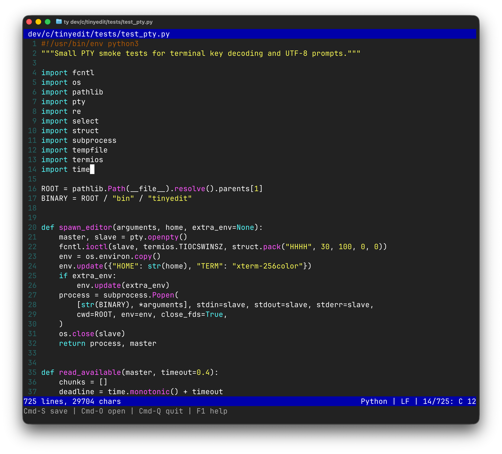
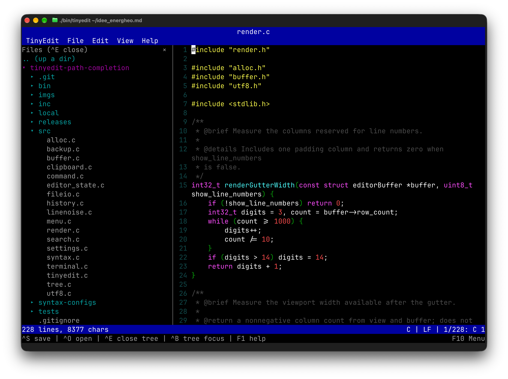
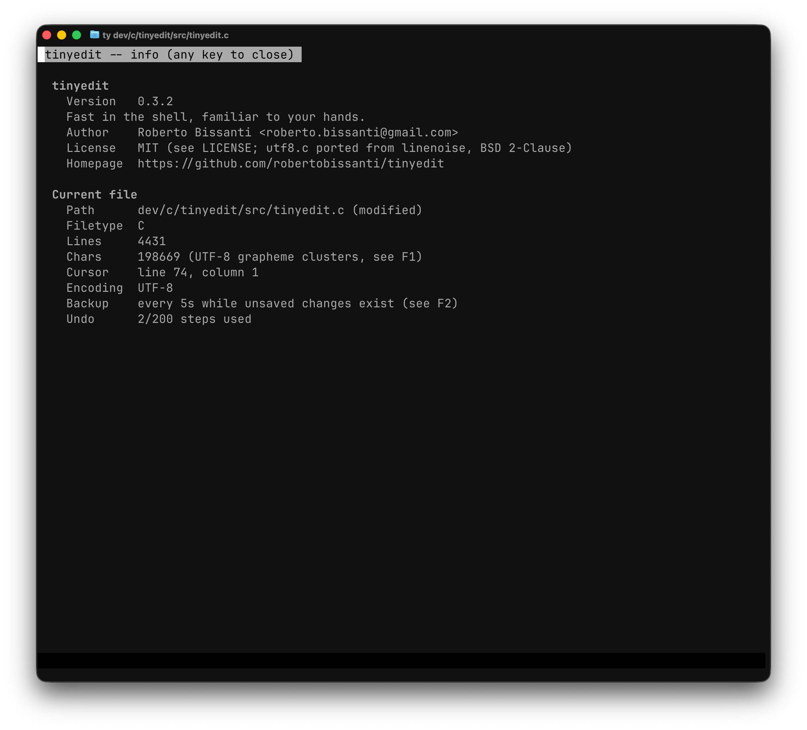
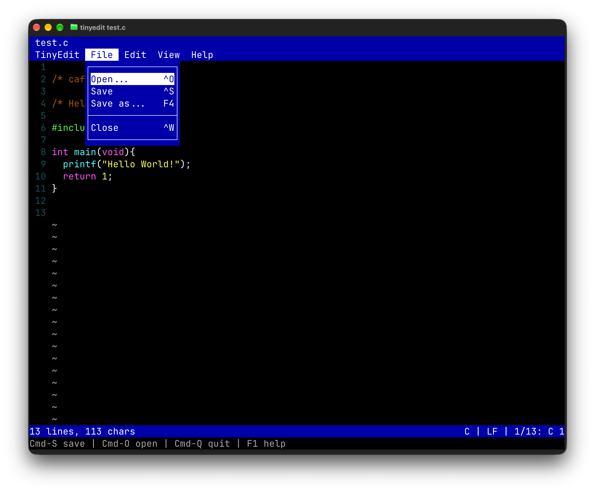
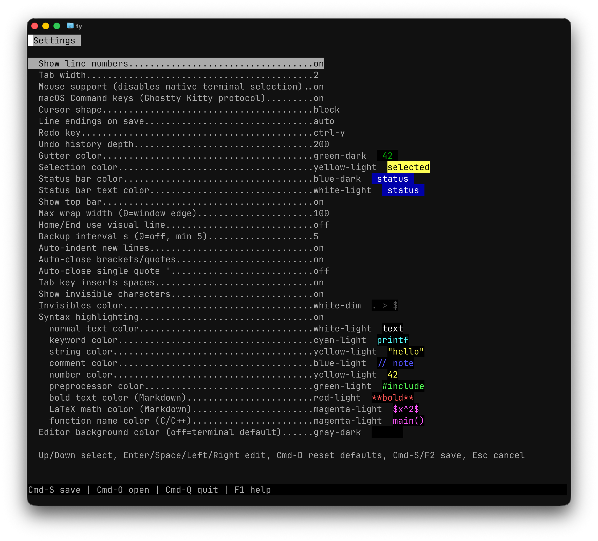
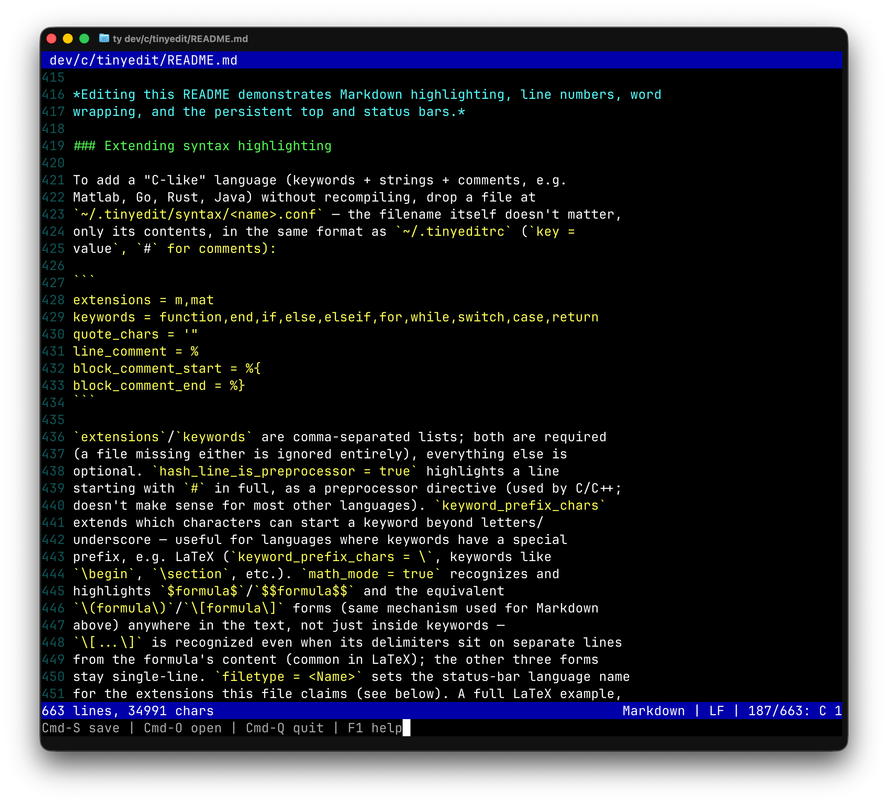
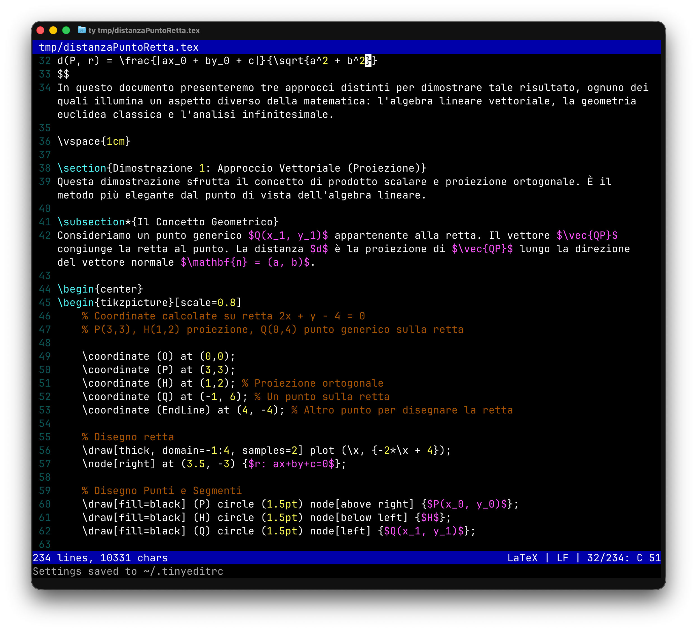
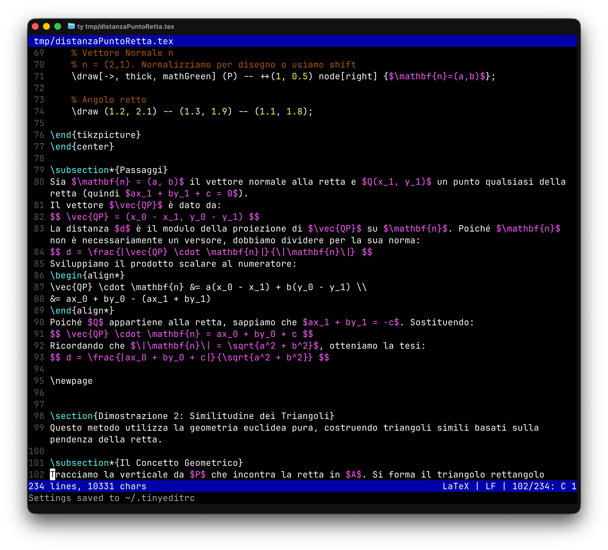

<div align="center">


# tinyedit

[](https://github.com/robertobissanti/tinyedit/releases)
[](LICENSE)
[](https://github.com/robertobissanti/tinyedit)
[](https://github.com/robertobissanti/tinyedit)

</div>

A small full-screen terminal text editor written in plain C (kilo-style,
after [kilo](https://github.com/antirez/kilo) by Salvatore Sanfilippo),
with no dependencies beyond the POSIX standard library.

tinyedit brings the familiar ease of a desktop text editor to the terminal.
It uses the terminal's alternate screen while open, then returns to the main
screen on exit with the shell prompt and scrollback intact.

Traditional terminal editors can require learning modal editing (Vim),
memorizing non-standard key sequences (Emacs), or working around limited
navigation and selection (Nano). tinyedit reduces that friction with familiar
shortcuts such as `Ctrl-C`, `Ctrl-V`, `Ctrl-Z`, and `Ctrl-F`, Shift+Arrow text
selection, and optional mouse support for clicking and scrolling.

## Contents

- [Why it exists](#why-it-exists)
- [Features at a glance](#features-at-a-glance)
- [Homebrew](#homebrew-macos--linux)
- [Build](#build)
- [Usage](#usage)
  - [Optional command installation](#optional-command-installation)
  - [Keyboard shortcuts](#keyboard-shortcuts)
  - [Experimental macOS Command keys in Ghostty](#experimental-macos-command-keys-in-ghostty)
  - [Opening and closing files](#opening-and-closing-files)
  - [File tree sidebar](#file-tree-sidebar)
  - [File information](#file-information)
  - [Fast terminal paste](#fast-terminal-paste)
  - [Mouse support](#mouse-support)
  - [Menus](#menus)
  - [Settings and appearance](#settings-and-appearance)
  - [Indentation and tabs](#indentation-and-tabs)
  - [Automatic pair and tag closing](#automatic-pair-and-tag-closing)
  - [Invisible characters and colors](#invisible-characters-and-colors)
  - [Soft wrapping and navigation](#soft-wrapping-and-navigation)
  - [Top and status bars](#top-and-status-bars)
  - [UTF-8 text](#utf-8-text)
  - [Syntax highlighting](#syntax-highlighting)
  - [Extending syntax highlighting](#extending-syntax-highlighting)
    - [Markup templates](#markup-templates)
  - [Ready-made syntax configurations](#ready-made-syntax-configurations)
  - [Find and replace](#find-and-replace)
- [Backup and crash recovery](#backup-and-crash-recovery)
- [Code layout](#code-layout)
  - [Function documentation](#function-documentation)
- [Project status](#project-status)
- [Author and license](#author-and-license)

## Why it exists

I kept building tinyedit because I became convinced that a terminal editor
could be simple enough to use every day. While implementing it, I paid close
attention to carrying over the mouse gestures and keyboard shortcuts people
already know from desktop text editors and word processors. The goal is not
to invent another editing language: it is to make opening a terminal file
feel immediately familiar.

There is still room to grow, such as adding multiple buffers to keep several
files open in one session. Future additions will be evaluated carefully to
keep the editor simple and focused.



*Python source in tinyedit, with line numbers, soft wrapping, file statistics,
and configurable syntax colors.*

## Features at a glance

tinyedit is intentionally small, but it is meant to be comfortable enough
for real editing rather than just demonstrating how a terminal works.

| Area | What you get |
|---|---|
| [Editing](#keyboard-shortcuts) | Familiar cursor movement, word jumps, selection, cut/copy/paste, automatic indentation, block indent/outdent with Tab, configurable pair and XML/HTML tag closing, matching-bracket highlighting, and an undo history of up to 2,000 steps (200 by default). |
| [Files](#opening-and-closing-files) | Open or switch files without restarting tinyedit, complete file paths with Tab, start a named file before it exists, save atomically, and recover unsaved work from automatic backups after a crash. |
| [Sidebar](#file-tree-sidebar) | Browse a persistent filesystem tree with keyboard or mouse, expand folders lazily, change its root, and open files with protection for unsaved edits. |
| [Search](#find-and-replace) | Incremental literal or POSIX regular-expression search, match navigation, and interactive search and replace. |
| [Syntax highlighting](#syntax-highlighting) | Built-in support for C/C++, Python, Shell, JavaScript/TypeScript, Markdown, HTML/XML, CSS, and JSON, including function names. Simple C-like languages and HTML-based templates (Nunjucks, Jinja, Liquid, Twig) can be added with a user configuration file; ready-made ones ship in `syntax-configs/`. |
| [UTF-8](#utf-8-text) | Cursor movement, deletion, display width, wrapping, and character counts understand combining marks, CJK text, and multi-code-point emoji. |
| [Long lines](#soft-wrapping-and-navigation) | Lines wrap at the terminal edge, preferably at word boundaries. Navigation follows the visible wrapped rows, without imposing a fixed line-length limit. |
| [Clipboard](#keyboard-shortcuts) | Uses the native macOS clipboard or the available Wayland/X11 clipboard tool directly, without sending commands through a shell. |
| [Terminal input](#fast-terminal-paste) | Fast bracketed paste, optional mouse selection and scrolling, and key-sequence handling for common macOS and Linux terminals. |
| [Menus](#menus) | A persistent menu bar with TinyEdit, File, Edit, View, and Help menus; keyboard and optional mouse navigation; shortcuts beside commands; and checked View settings. |
| [Interface](#top-and-status-bars) | Optional line numbers and top bar, visible whitespace, file statistics, in-editor help, and a settings panel. |
| [Configuration](#settings-and-appearance) | Settings live in `~/.tinyeditrc`; colors, tabs, wrapping, mouse behavior, interface elements, and editing assists can all be changed from `F2`. |
| [Portability](#build) | One C99 binary and no third-party runtime libraries. The supported targets are POSIX systems such as macOS and Linux. |
| [Testing](#code-layout) | Syntax, settings, backup, terminal-input, key-binding, and very-long-line behavior are covered by `make test`; sample files are included for hands-on checks. |

Settings can be changed from the built-in `F2` panel or by editing
`~/.tinyeditrc`, which tinyedit creates automatically on first launch.

The project also remains an exploration of how terminal interfaces work from
scratch: raw mode, ANSI escape sequences, input decoding, and manual redraw,
without reaching for a TUI framework. Its first prototype used
[linenoise](https://github.com/antirez/linenoise) for a command-driven line
editor. The current version is a true full-screen editor with a freely moving
cursor; linenoise remains in the repository for historical reference but is
not a build dependency.


## Homebrew (macOS / Linux)

If you use Homebrew on macOS or Linux, install tinyedit with

```sh
brew install robertobissanti/tinyedit/tinyedit

```

## Build

```sh
make        # produces the bin/tinyedit binary
make clean  # removes it
```

Needs only a C99 compiler and a POSIX system (macOS or Linux).

## Usage

```sh
bin/tinyedit [file]
```

### Optional command installation

The build output stays in `bin/tinyedit` without modifying your shell
configuration. To run `tinyedit` from any directory, install or symlink it
into a location in your `PATH`, such as `/usr/local/bin`:

```sh
make
sudo make install PREFIX=/usr/local
```

For an installation without administrator privileges, use
`make install PREFIX="$HOME/.local"` and add `~/.local/bin` to your `PATH`.
A permission error for `/usr/local/bin` is an installation failure; the compiled
binary remains available as `bin/tinyedit`.

### System clipboard on Linux

Ctrl-C/X/V use external clipboard tools when available: `wl-copy` and `wl-paste`
on Wayland, or `xclip` on X11. On Arch Linux with KDE/Wayland, install
`wl-clipboard` with `sudo pacman -S wl-clipboard`, then restart tinyedit.
For X11, install `xclip` instead. These are optional runtime tools; compiling
tinyedit does not require them.

If no tool is available, or access to the display fails, tinyedit falls back
to its internal clipboard, shared only within the current editor session.
Check `command -v wl-copy wl-paste` and run `wl-paste --no-newline` after copying
text from another application to diagnose Wayland access. Terminal-native paste
(such as Ctrl-Shift-V in Konsole) uses bracketed paste and does not require these tools.

### Keyboard shortcuts

| Key | Action |
|---|---|
| Arrows, Home, End, PageUp/Down | Move cursor |
| `Ctrl+Home` / `Ctrl+End` (or `Ctrl+PageUp` / `Ctrl+PageDown`) | Jump to the start/end of the file |
| `Alt+←` / `Alt+→` (or `Esc b` / `Esc f`) | Jump by word |
| `Shift+Arrows` / `Shift+PageUp` / `Shift+PageDown` / `Shift+Home` / `Shift+End` | Extend/start text selection (doesn't work on macOS Terminal.app; use `Ctrl-T` instead) |
| `Ctrl-T` | Toggle selection mode (extends selection with plain arrows, PageUp/PageDown, and Home/End; useful in terminals such as Terminal.app where Shift+Arrows is unsupported) |
| Enter | New line (inherits the previous line's indentation if `auto_indent` is on) |
| Tab | Indent (spaces or a literal tab, see `insert_spaces_for_tab`); with a selection, indents every selected line one level |
| `Shift+Tab` | Outdent the selected lines, or the current one when there's no selection |
| `(` `{` `[` `"` `` ` `` `$` | Auto-close the pair / skip over an existing closer / wrap the selection (if `auto_close_pairs` is on) |
| `'` | Same, but only when `auto_close_single_quote` is on (off by default, since apostrophes in prose are more common than pairs) |
| `>` in `.xml`, `.html`, or `.htm` | Auto-insert the matching closing tag (with `auto_close_pairs` on); HTML void elements such as `img` and `br` are left unclosed |
| Backspace / Delete | Delete a character (UTF-8 aware) |
| `Ctrl-A` | Select all |
| `Ctrl-C` / `Ctrl-X` / `Ctrl-V` | Copy / cut / paste (system clipboard; C/X need an active selection) |
| `Ctrl-Z` | Undo |
| `Ctrl-Y` | Redo |
| `Ctrl-F` | Incremental search (Arrows for next/previous match, `Ctrl-G` to toggle regex search, `Ctrl-R` to switch to search & replace, Esc to cancel) |
| `F1` | Help screen listing every shortcut (any key closes it) |
| `F3` | Info screen: version, author, and stats about the current file |
| `F2` | Settings panel (Up/Down to navigate, Enter/Space to edit, Left/Right to cycle options, `Ctrl-D` resets defaults, `Ctrl-S` saves and exits, Esc exits with a confirmation prompt if there are unsaved changes) |
| `F10` | Open or close the menu; use arrows to navigate, Enter to choose, or Esc to dismiss |
| `Ctrl-S` | Save (asks for a filename if none is set) |
| `F4` (or `Ctrl-Shift-S` where the terminal sends it) | Save as: always asks for a filename, even when one is already set |
| `Ctrl-E` | Show or hide the file tree. Opening focuses the tree. |
| `Ctrl-B` | Switch focus between the visible file tree and document. |
| `Ctrl-O` | Open another file by entering its path; offers to save the current file first. A missing path becomes a new file on first save. |
| `Ctrl-W` | Close the current file without quitting tinyedit; offers to save first and leaves an empty buffer. |
| `Ctrl-Q` | Quit (if there are unsaved changes, asks y/n/Esc: save-and-quit / quit without saving / cancel) |

### Experimental macOS Command keys in Ghostty

In Ghostty, tinyedit can optionally accept macOS Command shortcuts, including
`Cmd-S`, `Cmd-Z`, `Cmd-C`, `Cmd-X`, `Cmd-F`, and `Cmd-Q`, through the Kitty
keyboard protocol. Enable **macOS Command keys (Ghostty, experimental)** in
`F2`, or set `mac_command_keys = true` in `~/.tinyeditrc`, then reload
Ghostty with `Cmd-Shift-,`.

This Ghostty-specific mode is off by default because terminal programs do not
normally receive macOS Command-key events. While it is active, tinyedit
handles application shortcuts such as `Cmd-W`, `Cmd-Q`, and `Cmd-F`, and makes
`Cmd-C` and `Cmd-X` operate on its internal selection rather than the terminal
buffer. `Cmd-V` remains the terminal's native paste shortcut. Keyboard state
and the bindings managed by tinyedit are restored on exit, so no sequences
leak into the shell. Remove any older manual `super+...` keybind bridges from
your Ghostty configuration to avoid conflicts.

### Opening and closing files

tinyedit keeps one active document at a time, but changing files does not
require restarting the program. `Ctrl-W` closes the current document and
returns to an empty unnamed buffer. `Ctrl-O` asks for a path and replaces the
current document with that file. Before either operation, unsaved changes get
the same save/discard/cancel check used by `Ctrl-Q`; cancelling or failing to
save leaves the current document untouched. If the path entered for `Ctrl-O`
does not exist, tinyedit opens an empty buffer under that name and creates the
file when it is first saved.

In the Open, Save as, and first-save prompts, press **Tab** to complete file
and folder names. Repeated Tab presses cycle matching names alphabetically;
folders get a trailing `/`. Typing or deleting starts a new completion.
Relative paths, absolute paths, `~/`, spaces, and UTF-8 names are supported.
Hidden names are offered when the last component starts with `.`. You can
still type a new filename when saving.

### File tree sidebar



Press `Ctrl-E` to show the filesystem tree on the left, rooted at the directory
where tinyedit started. Press `Ctrl-E` again to hide it. `Ctrl-B` switches focus between the tree and
the document while keeping the sidebar visible. Click either pane to focus it when mouse
support is enabled. The sidebar stays visible while editing.

In the tree, Up/Down move one entry at a time. PageUp/PageDown move by one
visible page; Home selects the first entry (`..`), and End selects the last
entry, scrolling it into view. Right on a folder makes it the new root of the tree. A single mouse click
on a folder name or triangle expands or collapses it; a double click makes
it the new root. Left collapses a
folder or selects its tree parent.
Enter toggles a folder or opens a file; Space also toggles a folder. Opening
a file uses the usual save/discard/cancel
confirmation for unsaved changes. Esc returns to the document; Tab keeps its normal indentation behavior
in the document. `r` reloads the tree,
`g` opens a path prompt: type a directory and press Enter to make it the
new tree root, or Esc to cancel. Up from the root selects `.. (up a dir)`;
Enter or a double click on that entry goes up one directory. Left collapses
folders or selects their tree parent without changing the root. `Ctrl-C` copies the selected path.

Close the sidebar with `Ctrl-E` from either pane, the `×` in its header when mouse
support is enabled, or **View → Show/hide file tree**. Folders are sorted before
files. Expansion loads one level at a time on request. Symlinks to directories use
the same triangle, expansion and navigation as folders, while keeping the
distinct symlink color.
Double-click or Right on a directory symlink makes its target the new root.
Sidebar colors reuse the configured syntax palette: keyword for directories
and the parent entry, preprocessor for symlinks and the root, and normal text
for files, even when syntax highlighting is disabled.
The sidebar grows up to half the terminal width, shifts deep indentation left,
and abbreviates long names in the middle while retaining their extensions.
The top bar keeps showing the current document name and modified indicator
while navigating the tree. Below 40 terminal columns the sidebar is temporarily hidden.

PNG and other binary files containing NUL bytes are rejected on opening,
leaving the current document intact. Malformed UTF-8 text remains editable.

Sidebar hints follow the focused pane and return after temporary messages
expire. Closing the tree restores the document shortcuts in the bottom bar.

### File information



*The `F3` screen summarizes the program version and the current file without
leaving the editor.*

### Fast terminal paste

Pasting text directly into the terminal (Cmd+V or right-click, not
just the editor's own `Ctrl-V` which reads the system clipboard) is
handled via [bracketed
paste](https://en.wikipedia.org/wiki/Bracketed-paste): pasted text is
inserted in one shot instead of character by character, so it's
instant even for thousands of lines, and it doesn't trigger auto-close
on parentheses/quotes/backticks that happen to be in the pasted text
(which would otherwise be treated as if the user had typed them one at
a time). This requires terminal support for the protocol, which is available
in virtually every modern terminal, including Ghostty, iTerm2, and Terminal.app.
If paste feels slow inside `tmux` or `screen`, ensure bracketed-paste
passthrough is enabled in the multiplexer.

### Mouse support

Mouse support (`mouse_enabled`, F2 panel, **off by default**) lets you
click to place the cursor, drag with the left button to select text,
Shift-click to extend a selection, and scroll with the wheel. It is opt-in
because it overrides the terminal's native text selection, such as
`Cmd-C`/`Cmd-V` in Ghostty, and directs mouse events to tinyedit while enabled.
The change takes effect
immediately: toggling it in `F2` and pressing `Ctrl-S` applies it
right away, no restart needed.

### Menus

The menu bar is visible below the optional top bar by default. Press `F10` to
open it, use Left/Right to switch menus and Up/Down to select a command, then
press Enter to run it or Esc to close it. With `mouse_enabled` on, you can
click a menu, hover over items or another menu to change the selection, and
click an item to run it; clicking outside closes the open menu.

`TinyEdit` contains Info, Settings, and Quit; `File` has file operations;
`Edit` has editing commands and Find; `View` has checked switches for line
numbers, the top bar, the menu itself, invisible characters, syntax
highlighting, and automatic indentation; and `Help`
opens the shortcut reference. Existing keyboard shortcuts appear beside
commands, with `^` meaning Ctrl (for example, `^S` means `Ctrl-S`). The
`F10 Menu` hint in the bottom message bar also opens the menu when clicked.

To hide the menu bar, turn off **Enable F10 menu** in `F2` Settings or set
`show_menu = false` in `~/.tinyeditrc`. `F2` remains available to turn it back
on.



*The File menu shows commands and their keyboard shortcuts.*

### Settings and appearance

Line numbers (gutter), tab width, interface colors, soft-wrap, the top bar,
auto-indent, auto-close pairs, tabs-as-spaces, and invisible characters are
configurable from the `F2` panel and saved to `~/.tinyeditrc`. See the file
itself, created automatically on first launch, for configuration details.
Inside `F2`, `Ctrl-D` resets every setting back to its
default (still needs `Ctrl-S` to actually take effect). Upgrading
tinyedit never requires touching an existing `~/.tinyeditrc`: keys
that aren't in the file (because they were introduced by a newer
version) simply stay at their default until set explicitly.



*The built-in `F2` panel exposes the same options stored in `~/.tinyeditrc`,
including undo depth, wrapping, backup, colors, and mouse support.*

### Indentation and tabs

With `auto_indent` on (default), Enter copies the leading
whitespace of the line you're moving away from, so continuing to type
keeps the same indentation level without retyping it by hand. With
`insert_spaces_for_tab` on (default), the Tab key inserts `tab_stop`
spaces instead of a literal tab character.

With an active selection, Tab indents every selected line one level and
`Shift+Tab` outdents them; with no selection, `Shift+Tab` outdents the
current line. Each press is a single undo step, and the selection stays
put afterwards so the shortcut can be repeated. Outdent accepts
whatever indentation the file already uses rather than only the flavor
tinyedit would produce: a leading tab counts as one full level,
otherwise up to `tab_stop` spaces are removed, stopping at the first
non-space so a partially indented line only loses what it has.

### Automatic pair and tag closing

With `auto_close_pairs` on (default), typing `(`, `{`, `[`, `"`,
`` ` ``, or `$` inserts the matching closing character automatically
with the cursor left in between; typing the closer by hand when the
next character is already that closer skips over it instead of
duplicating it (except for `` ` ``, see below); with an active text
selection, typing an opening character wraps the selection in the
pair instead of replacing it. The single quote `'` has its own switch,
`auto_close_single_quote`, off by default: in prose an apostrophe
(`don't`, `user's`) is far more common than a matching pair, so
auto-closing it gets in the way in a manner `(` or `"` doesn't. Curly quotes (`«»`, `""`, `''`) behave
the same way as the other pairs, even when composed via an OS
compose sequence or pasted rather than typed directly, since none of
them exist on a standard keyboard. `$$` (LaTeX display math, typing
`$` four times in a row) is recognized as a special case of the `$`
pair: it opens `$$...$$` instead of nesting a second pair. One more
Right arrow after the sequence exits the nested structure entirely.
The single backtick `` ` `` is the one exception to skip-over: typing
it always opens a fresh pair instead of skipping past an existing
closer, because in Markdown a lone backtick is also valid syntax on
its own (inline code) typed several times in a row on the same line,
not only as this pair's closer. The triple-backtick Markdown code
fence (`` ``` ``) is intentionally not auto-closed, as auto-closing
multi-line fences often interferes with regular editing.

When the cursor is on or immediately after `(`, `)`, `[`, `]`, `{`, or `}`,
tinyedit highlights that bracket and its matching partner using the selection
color. It follows nested brackets across lines and works on existing or pasted
text too, independently of `auto_close_pairs`. Matching uses the text itself;
it does not distinguish brackets inside strings or comments. Quotes, backticks,
and `$` are not included in this highlight.

In `.xml`, `.html`, and `.htm` files, typing `>` immediately after an
opening tag also inserts its matching end tag and leaves the cursor between
the two: `<section>` becomes `<section>|</section>`. This uses the same
`auto_close_pairs` setting. XML self-closing tags such as `<item/>` are left
alone. For HTML, tinyedit also recognizes the standard void elements —
`area`, `base`, `br`, `col`, `embed`, `hr`, `img`, `input`, `link`, `meta`,
`param`, `source`, `track`, and `wbr` — and does not add an invalid closing
tag for them. XML has no such void-element rule, so `<br>` in an XML document
correctly becomes `<br>|</br>`.

### Invisible characters and colors

With `show_invisibles` on (off by default), spaces and tabs render as
dedicated glyphs (`.` for space, `>` for tab) and every line ending
shows a `$`, all in the color set by `color_invisibles` (same palette
as the gutter/selection/status bar, gray by default).

Gutter, selection, status bar, and invisibles colors are all picked
from a palette of 24 (each of the 8 base hues, gray, blue, green,
yellow, cyan, magenta, red, and white, in three variants: light `-light`,
dark `-dark`, and dim `-dim`, e.g. `cyan-dim`), always plain ANSI
codes, never 256-color or truecolor (`-dim` support is somewhat less
consistent across terminals; some render it identically to `-dark`
instead of actually dimming it, but it is still base ANSI). In the
`F2` panel, Left/Right cycle the selected color back/forward (in
addition to Enter/Space, which only advances). This is handy for jumping back
a step without scrolling through the whole palette. `~/.tinyeditrc`
files written by older versions (unsuffixed names, e.g. `color_gutter
= cyan`) are recognized automatically on load and mapped to the
corresponding `-light` variant (the one the old palette actually
rendered), without losing the customization.

Every color row in the `F2` panel shows a live swatch of its value next
to the name, so you can preview the selection without leaving the panel.

`color_background` paints the whole editor area: rows, gutter, and the
empty space below the text. It defaults to `terminal-default`, which
emits no background escape at all and leaves the terminal's own
background untouched. Its `-dim` variants are skipped while cycling:
the dim attribute only applies to foreground text, so as a background
each would be indistinguishable from its `-dark` twin. Note that
`gray-dark`/`gray-dim` are plain black in this palette (the ANSI hue
named "gray" is black at normal intensity), so they look like no
background at all on a terminal whose own background is already dark.
The editor resets its visual terminal state on exit, so a selected
background does not remain active in the shell.

`cursor_style` selects `block` (the default) or `bar` (I-beam). It uses
the standard DECSCUSR terminal escape sequence; terminals without that
extension keep their normal cursor shape.

`line_ending` controls the format written on save: `auto` (default)
preserves the first line-ending style detected when opening the file,
while `lf` and `crlf` force conversion to that format. The status bar shows
the effective style as `LF` or `CRLF`; a trailing `*` means the input
file contained a mix of both styles, and auto will use the first one.

When the settings list doesn't fit the screen, a column on the left
(like the line-number gutter) shows `^` on the first visible entry if
there are more above, and `v` on the last one if there are more below.

### Soft wrapping and navigation

Lines too long for the screen width always wrap (soft-wrap is always
on, there's no horizontal scrolling), breaking on a space where
possible. `soft_wrap` (`0` by default, meaning no extra limit beyond
the window edge) sets an optional column cap narrower than the window, which
helps keep lines readable on ultra-wide displays. Up/Down and
PageUp/PageDown always move by *visual* row rather than file row, so
moving down a long line advances one visual segment at a time instead
of jumping the whole line. Home/End follow the same convention by
default (`home_end_visual_line = true`, VS Code/Sublime style); set to
`false` (vim style) they always go to the start/end of the whole
*logical* line, regardless of how many visual rows it wraps into.

`scrolloff` controls cursor context while navigating long text: it keeps
that many visual rows above and below the cursor where possible. Its default
is `0`, which keeps the current edge-following behavior; values from `1` to
`20` progressively keep the cursor away from the top and bottom of the view.
Near the start or end of a file the viewport remains clamped to available
text, so the requested margin may be smaller.

### Top and status bars

The filename and modified indicator are centered in the optional top bar.

Enable **Markdown bold and italic** in F2 (or set
`markdown_text_styles = true` in `~/.tinyeditrc`) to render Markdown emphasis
with bold/italic terminal attributes and headings in bold. Markup remains
visible and editable; syntax highlighting must be enabled. The option is off
by default and combines with heading reverse video.

For Markdown ATX headings (`#` through `######`), enable **Reverse Markdown
heading colors** in F2, or set `markdown_heading_reverse = true` in
`~/.tinyeditrc`. This swaps the existing heading foreground and editor
background using terminal reverse video, including right-hand padding,
and wrapped continuations. Line numbers keep their normal style. Syntax highlighting must be enabled. Code fences,
front matter, and math blocks retain their ordinary appearance. Set the option
to `false` to disable it. Setext headings (`===` or `---`) are not covered.

Selection and search highlighting take precedence over Markdown heading
reverse video and inline bold/italic styles, including selected newline cells.
The empty area to the right of an ATX heading retains its heading background.


The optional top bar (`show_top_bar`) shows only the filename (without its directory path) and
unsaved-changes state as a persistent title. Its text and background use the
reverse of the configured status bar colors, whether the menu is visible or hidden.
This is useful on long files
where you lose track of position while scrolling. When it's on, the
filename doesn't repeat in the bottom status bar (which then shows
only line/char counts); when it's off, the filename shows up there
instead. The unsaved-changes indicator is always visible in the
bottom bar either way. The bottom bar also shows the cursor's actual
source byte column, on the right (`line/total: C column`) next to the line number.

### UTF-8 text

UTF-8 support includes code point decoding, grapheme cluster boundaries
(emoji with modifiers, ZWJ, combining marks), and display width (0/1/2
columns) for the cursor, backspace, and rendering, not just European accented
characters but CJK and emoji too. The status bar's character count is
grapheme clusters, not raw bytes (a modified emoji counts as 1
character, not however many bytes it takes in the buffer).
The grapheme and width helpers began as a port from
[linenoise](https://github.com/antirez/linenoise); the bounded, strict decoder
is original to tinyedit and accepts only well-formed UTF-8, including `0x00`.
It rejects isolated continuation bytes, overlong encodings, surrogate code
points, values above `U+10FFFF`, and incomplete sequences. Each bad byte is
one cursor and deletion step, displayed as `�`; valid bytes after it are
decoded normally. Display never rewrites the file buffer. Saving an otherwise
unchanged file preserves its UTF-8 bytes and whether its final row has a newline.

### Syntax highlighting

With `syntax_highlight` on (default), files get highlighted based on
their extension: keywords/types, strings, comments (line and
multi-line block where applicable), and numbers, each with its own
configurable color (`color_syntax_keyword`, `color_syntax_string`,
`color_syntax_comment`, `color_syntax_number`,
`color_syntax_preprocessor`, plus `color_syntax_emphasis_strong` for
Markdown bold text, kept distinct from italic which uses
`color_syntax_keyword`, and `color_syntax_function` for function
names), same 24-color palette as the rest of the interface. Function
names are recognized by the same heuristic other lightweight editors
use, an identifier immediately followed by `(`, which covers both
calls and definitions. Text with no class at all (identifiers, punctuation,
whitespace) uses `color_syntax_normal`, defaulting to
`terminal-default`, a 25th palette entry (not a real hue, only
available for this setting) meaning "no color forced, terminal's own
foreground", the same behavior this had before the setting existed;
set it to any real hue to recolor plain text explicitly. Natively
supported languages: C/C++ (`.c` `.h` `.cpp` `.cc` `.cxx` `.hpp` `.hh`
`.hxx`), Python (`.py`), Shell (`.sh` `.bash` `.zsh`), JavaScript/
TypeScript (`.js` `.jsx` `.ts` `.tsx`), Markdown (`.md` `.markdown`, with
headings, `` `inline code` ``, multi-line code fences, italic
`*...*`/`_..._`, bold `**...**`/`__..._` (both may span several lines),
links and images, YAML front matter, and
embedded HTML tags), HTML/XML (`.html` `.htm`
`.xml`, with tags, attributes, and `<!-- -->` comments), and CSS (`.css`, with
properties, values, comments).

Two constructs common in static-site Markdown get their own handling.
A YAML **front matter** block, the `---` delimited metadata header
used by Jekyll, Eleventy and Hugo, is highlighted as structured data
rather than prose: delimiters and the `:` as markers, keys as keywords,
values as strings. It's recognized only when the opening `---` is the
file's first line, so a `---` further down stays a horizontal rule.
Blank lines inside the block don't end it.

**HTML tags embedded in the document** (`<div class="box">`,
`<strong>`) are highlighted like they would be in an `.html` file,
tag names and attributes as keywords, quoted values as strings. The
scanner uses a conservative rule: a `<` must be followed by a
letter and reach a `>` on the same line, so prose like `5 < 7` is left
alone, and a tag inside a code span (`` `<div>` ``) or a fenced block
stays code.

**Links and images** are highlighted with the label and the
destination in different colors, so a row of badges stays readable
instead of drowning in URL text. The nested `[](url)` form
that badges use is handled, as are parentheses inside a URL. An
unmatched `[text]` is left as prose.

**Emphasis may span several lines**, which is common when a caption or
an italic sentence is wrapped across rows. A span is closed by its
matching marker or by a blank line. Bounding it at the paragraph
means a stray `*` in prose (`filetype.*`, `5 * 3`) can't recolor the
rest of the document. A marker followed by whitespace isn't treated as
an opener at all.



*Editing this README demonstrates Markdown highlighting, line numbers, word
wrapping, and the persistent top and status bars.*

JSON object keys have their own color (`color_syntax_json_key`, cyan by
default); string values use `color_syntax_string`. A quoted string followed
by a colon on the same logical line is recognized as a key, including escaped
quotes and Unicode text. JSON highlighting is built in; existing `json.conf`
definitions remain compatible.

The **Syntax: bracket color (all files)** option in `F2`
(`color_syntax_bracket`, yellow by default) colors `()`, `[]`, and `{}`,
including in unnamed files and files without a recognized syntax. It also
works with syntax highlighting disabled. With syntax highlighting enabled,
strings, comments, and other classified spans keep their own colors.
Selection, search matches, and matching-bracket highlighting take priority.

### Extending syntax highlighting

To add a "C-like" language (keywords + strings + comments, e.g.
Matlab, Go, Rust, Java) without recompiling, drop a file at
`~/.tinyedit/syntax/<name>.conf`; the filename itself doesn't matter,
only its contents, in the same format as `~/.tinyeditrc` (`key =
value`, `#` for comments):

```
extensions = m,mat
keywords = function,end,if,else,elseif,for,while,switch,case,return
quote_chars = '"
line_comment = %
block_comment_start = %{
block_comment_end = %}
```

`extensions`/`keywords` are comma-separated lists; both are required
(a file missing either is ignored entirely), everything else is
optional. `hash_line_is_preprocessor = true` highlights a line
starting with `#` in full, as a preprocessor directive (used by C/C++;
doesn't make sense for most other languages). `keyword_prefix_chars`
extends which characters can start a keyword beyond letters/
underscore, useful for languages where keywords have a special
prefix, e.g. LaTeX (`keyword_prefix_chars = \`, keywords like
`\begin`, `\section`, etc.). `math_mode = true` recognizes and
highlights `$formula$`/`$$formula$$` and the equivalent
`\(formula\)`/`\[formula\]` forms (same mechanism used for Markdown
above) anywhere in the text, not just inside keywords.
`\[...\]` is recognized even when its delimiters sit on separate lines
from the formula's content (common in LaTeX); the other three forms
stay single-line. `filetype = <Name>` sets the status-bar language name
for the extensions this file claims (see below). A full LaTeX example,
`~/.tinyedit/syntax/latex.conf`:

```
extensions = tex,latex,sty,cls
keywords = \begin,\end,\section,\label,\ref,\cite,\textbf,\textit
line_comment = %
keyword_prefix_chars = \
math_mode = true
```

<p align="center">
  
  
</p>

*A user-defined LaTeX syntax configuration highlights commands and mathematical
expressions without adding a compiled-in language or an external dependency.*

#### Markup templates

A template format like Nunjucks, Jinja, Liquid or Twig is HTML with a
second language embedded in it, which the C-like tokenizer above can't
express because it has no notion of a tag. Two extra keys route such a
language through the markup tokenizer instead:

```
extensions = njk,nunjucks
filetype = Nunjucks
base_tokenizer = xml
template_delimiters = {{ }}, , {\# \#}
```

`base_tokenizer = xml` highlights tags and attributes exactly as in an
`.html` file, and `template_delimiters` lists the embedded expression
delimiters as comma-separated `open close` pairs. Those blocks are highlighted
as a unit, with delimiters in the preprocessor color and contents in the
function color, even inside attribute values. For example,
`href="{{ url }}"` highlights the dynamic expression rather than rendering it
as a single string.
A pair whose opener starts with `{#` is treated as that language's
comment and colored like every other comment.

Note the `\#` escapes: `#` normally starts a comment in a `.conf` file,
so a `#` that's part of a value has to be escaped. With
`base_tokenizer = xml`, the `keywords` key isn't required (the markup
tokenizer doesn't use it).

Every `.conf` file in `~/.tinyedit/syntax/` gets loaded at startup
(silently skipped if malformed, same tolerance as `~/.tinyeditrc`); a
user file can redefine an extension already covered natively, and it
wins. Languages with a grammar that doesn't reduce to
keywords/strings/comments, where prefixed keywords and math mode
still are not enough, such as Markdown/HTML/CSS, cannot be extended
from an external file; they need a dedicated tokenizer in `syntax.c`.

### Ready-made syntax configurations

The [`syntax-configs/`](syntax-configs/) directory ships configuration
files for a few languages that aren't compiled in, so they can be used
without writing one from scratch: LaTeX (`.tex`, `.latex`, `.sty`,
`.cls`), Matlab/Octave (`.m`, `.mat`), and the markup templates
Nunjucks (`.njk`), Jinja (`.jinja`, `.j2`), Liquid (`.liquid`) and Twig
(`.twig`). Install them by copying into the directory tinyedit scans:

```bash
mkdir -p ~/.tinyedit/syntax && cp syntax-configs/*.conf ~/.tinyedit/syntax/
```

or, equivalently, from the repository root:

```bash
make install-syntax
```

That target never overwrites a file you already have (it prints
`skip` for those); use `make install-syntax-force` to replace them with
the shipped versions. Syntax installation is separate from the default build
step so compiling the editor never touches your home directory or modifies
your existing configurations.

Copy a single file instead of the whole set if you only want one. See
[`syntax-configs/README.md`](syntax-configs/README.md) for what each one
covers and for two non-obvious constraints of the format: comment
delimiters are matched before keywords, and `keyword_prefix_chars` can
merge adjacent tokens. Both can produce wrong highlighting rather than a
load error when you hit them.

The status bar also shows the filetype detected from the extension
(e.g. `C`, `Python`, `Markdown`) next to the line/column position. It
covers roughly 30 common extensions; to add more or override a name,
add `filetype.<extension> = <Name>` lines to `~/.tinyeditrc` (e.g.
`filetype.m = Matlab/Octave`).

A syntax `.conf` can also carry that name itself, with a `filetype`
key, so one file defines both how a language is highlighted and what
it's called:

```
filetype = Nunjucks
```

When a file is opened, the name is resolved in this order:

1. **`~/.tinyeditrc` (or the built-in table) already knows the
   extension.** That name is used. If it came from a user override but
   no syntax `.conf` (and no compiled-in language) covers the
   extension, the status bar reports `Filetype 'X': highlight config
   missing`; the name shows but nothing gets colored, and this says
   why.
2. **Nothing knows it, but an installed `.conf` claims the extension
   and declares `filetype`.** The name is applied, highlighting works,
   and the entry is written to `~/.tinyeditrc` so the extension is
   recorded from then on.
3. **Neither.** The field is omitted, as before.

Because step 2 writes to `~/.tinyeditrc` and step 1 reads it first,
editing a `.conf`'s `filetype` afterwards won't change the name already
recorded there. Update the `filetype.<extension>` line in
`~/.tinyeditrc` (or delete it to let the `.conf` be consulted again).

### Find and replace

Inside the Find prompt (`Ctrl-F`), `Ctrl-G` toggles whether the
search string is interpreted as a POSIX extended regular expression
(`<regex.h>` from libc, zero external dependencies) instead of a
literal string. The prompt shows `[regex]`/`[literal]` for the
current mode, updated the instant Ctrl-G is pressed. The mode isn't a
persistent setting: it resets to literal on every new search
(`Ctrl-F`). Switching to search-and-replace (`Ctrl-R`) keeps whatever
mode was chosen, shown there too.

In regex mode, replacement text understands `\n` (new line), `\t` (tab),
`\r` (carriage return), and `\\` (a literal backslash). This makes it
possible, for example, to search for the visible two-character sequence
`\\n` with the regex `\\\\n` and replace it with real line breaks by
entering `\n` in the replacement prompt. Other backslash sequences are
preserved literally.

The search/replace prompt adapts to available width in three stages,
always leaving room for the text being typed: it starts by spelling
out every shortcut (`Esc cancel, Arrows jump, Ctrl-R replace, Ctrl-G
regex`), shrinks to a short form (`Search [mode]:`) once the growing
query wouldn't leave room for both, and if even that isn't enough the
message bar scrolls to always show the most recent part of what's
being typed. The message's leading part (whatever is left of the
fixed instructions) is what disappears first.

## Backup and crash recovery

If `backup_interval` (F2 panel, off by default) is set to a nonzero
value (5 seconds effective minimum), the editor periodically writes a
recovery copy of the buffer while there are unsaved changes, to
`~/.tinyedit/backup/` (never next to the original file). The copy is
removed automatically after a successful save or a clean exit. Its
mere presence the next time you open that file is the signal that the
previous session didn't close cleanly (crash, kill, terminal closed).
In that case the editor shows a full-screen warning (not just a
status-bar message, to avoid silently missing the chance to recover)
and asks whether to restore the changes before proceeding.

## Code layout

- `src/`, `inc/`: C source files and corresponding public/internal headers.
  `Makefile` supplies `-Iinc` to every compilation.
- `src/tinyedit.c`, `inc/tinyedit.h`: Application flow, editing commands,
  session/view orchestration, frame drawing and the settings panel.
  Shared types and macros live in the header, while implementation logic stays
  in the `.c` file.
- `src/alloc.c`, `inc/alloc.h`: Checked application allocations. Failure exits
  through the registered terminal cleanup handlers.
- `src/buffer.c`, `inc/buffer.h`: Dynamic logical rows and source-text mutations.
- `src/history.c`, `inc/history.h`: Differential undo/redo for changed rows,
  owned source swaps, cursor restoration, edit coalescing and transactional
  rollback. Both stacks share a memory budget.
- `src/render.c`, `inc/render.h`: UTF-8 layout, wrapping caches and conversions
  between source positions and visual rows/columns.
- `src/terminal.c`, `inc/terminal.h`: Raw mode, terminal feature setup/cleanup,
  key decoding and terminal I/O.
- `src/tree.c`, `inc/tree.h`: Owned filesystem tree, lazy expansion, sorting,
  collapse, root replacement and sidebar width calculation.
- `src/search.c`, `inc/search.h`: Literal and POSIX regex matching, with
  reusable compiled queries and cached text for multiline search. Returns
  source-byte coordinates; the editor owns session navigation and applies
  results to its cursor and highlight. Text caches are invalidated after edits,
  undo/redo and document replacement.
- `src/clipboard.c`, `inc/clipboard.h`: System clipboard integration (macOS
  `pbcopy`/`pbpaste`, Linux `wl-clipboard` or `xclip`), falling back
  to an internal buffer when no system backend is available. Wired to
  the editor via `Ctrl-C`/`Ctrl-X`/`Ctrl-V`.
- `src/utf8.c`, `inc/utf8.h`: UTF-8 decoding, grapheme cluster boundaries,
  and terminal display-width calculation, ported from linenoise (see
  above). Used for cursor movement, backspace, and rendering.
- `src/settings.c`, `inc/settings.h`: Persistence of user settings
  (`~/.tinyeditrc`), a descriptor table that drives both the file
  parser and the `F2` panel.
- `src/command.c`, `inc/command.h`: Shared command labels, shortcuts, and
  links to settings toggles.
- `src/menu.c`, `inc/menu.h`: Menu bar and popup drawing, plus keyboard and
  mouse navigation.
- `src/syntax.c`, `inc/syntax.h`: Syntax highlighting, with a generic tokenizer
  for "C-like" languages driven by per-language tables (including
  ones loaded at runtime from `~/.tinyedit/syntax/*.conf`), plus
  dedicated tokenizers for Markdown, HTML/XML, and CSS. A `.conf` can
  route its language through the markup tokenizer (`base_tokenizer =
  xml`) and declare embedded `template_delimiters`, which is how the
  HTML-template languages are supported without compiled-in code.
- `src/editor_state.c`, `inc/editor_state.h`: Selection range normalization
  and the shared ASCII auto-close pair policy used by typing and closer skipping.
- `src/fileio.c`, `inc/fileio.h`: Staged document loading, exact LF/CRLF
  terminator handling, atomic file replacement and directory synchronization.
  Open and Save as expand a leading `~` or `~/` using `HOME`, keeping the
  expanded document identity for future saves and recovery. Other filename
  characters stay literal. A failed load keeps the current document; Save as commits its name only
  after successful file and directory synchronization. If replacement succeeds
  but directory synchronization fails, the editor retains its old name, dirty
  state and recovery copies and reports that durability is unconfirmed.
- `src/backup.c`, `inc/backup.h`: Periodic crash-recovery backups, saved to
  `~/.tinyedit/backup/` (never next to the original file). Wired to
  the editor via the `backup_interval` setting.
- `syntax-configs/`: Ready-made `.conf` language definitions to copy
  into `~/.tinyedit/syntax/` (or install with `make install-syntax`):
  LaTeX, Matlab/Octave, and the markup templates Nunjucks, Jinja,
  Liquid and Twig. They are data, not code; see its own
  [`README.md`](syntax-configs/README.md).
- `src/linenoise.c`, `inc/linenoise.h`: linenoise's original sources
  (antirez), kept for historical reference from the first
  line-editor prototype. Not compiled into the current binary (except
  for the UTF-8 logic, ported separately into `utf8.c`).

### Function documentation

Functions use Doxygen-style comments in English, including private helpers and
historical linenoise code. `@brief` explains the purpose in one sentence;
`@details` describes how to call the function, its side effects and ownership;
`@param` clarifies arguments whose units or roles need explanation; `@return`
describes results and failure values; `@note` preserves useful design rationale.
Only include tags that add information, rather than restating the signature.

Benchmark methodology and limits are described in
[`tests/README.md`](tests/README.md).
`make benchmark` measures CPU work without terminal I/O. Wrapped drawing locates
its first visible segment once, then walks the viewport; character counts and
matching pairs reuse document caches, invalidated after source changes and
history restoration. Pair results also depend on the cursor position. Output
buffers grow geometrically. Undo records only modified rows and structural row
changes. A one-byte edit retains the affected row, so very long single lines
still cost their full row size. Undo/redo transfer owned source spans without
allocating source text; replay display text is prepared before changing the
history position.

`undo_memory_mb` defaults to **64 MiB** and limits the combined undo/redo
journal. It is available in F2 and `~/.tinyeditrc`; changes take effect after
closing/opening a document or restarting the editor. `undo_max_depth` remains
a second limit. Successful edits may remove the oldest complete actions, with
a status message. An individual action exceeding the budget is cancelled and
its text, cursor, selection and existing history are restored.

The journal charges metadata and the maximum source capacity required by each
record in either direction. A pending edit has a separate reservation, also
bounded by the same budget, so retained plus pending journal reservations can
reach twice the setting. The live document, row-vector capacity, temporary
render/highlight caches and allocator overhead are additional costs; this
setting is not a limit on process RSS or a guarantee against kernel OOM kills.
No compression or external dependencies are used.

Application allocations use `teMalloc`/`teRealloc`/`teStrdup` and terminate with
terminal cleanup on failure. Recording and replay preparation use documented
recoverable `teTryMalloc`/`teTryRealloc`: failed journal/source allocations roll
back the entire edit; failed replay rendering leaves undo/redo unchanged and
can be retried. Highlight allocation failure falls back to unstyled text.
Other application allocations retain the existing controlled-exit contract. POSIX APIs that allocate internally (`getline`,
`realpath`) have a separate recoverable error contract: load/save/backup report
failure and preserve the active document. Only `ENOENT` permits the path fallback
for a target that has not been created yet.

Public contracts are available in `inc/` and beside their definitions in `src/`;
private helpers are documented at their definitions. State explicitly whether
positions are source-byte offsets, render-byte offsets, display columns or
visual rows, and whether range ends are exclusive. For returned allocations,
explain who releases them and whether they are NUL-terminated. Editing helpers
also say who records undo and refreshes derived row data. Keep comments aligned
with behavior when changing a function; Doxygen is optional and is not a build
dependency.

## Project status

See [`IDEAS.md`](IDEAS.md) for future features not yet prioritized, and
the repository issues and pull requests for publicly discussed work.

## Author and license

Copyright © 2026 Roberto Bissanti <roberto.bissanti@gmail.com>.
Released under the MIT license; see [`LICENSE`](LICENSE). The code
ported from linenoise (`src/utf8.c`/`inc/utf8.h`, plus
`src/linenoise.c`/`inc/linenoise.h` vendored for historical reference,
see above) stays
under Salvatore Sanfilippo and Pieter Noordhuis's original BSD
2-Clause license; see
[`LICENSE-THIRD-PARTY`](LICENSE-THIRD-PARTY).
