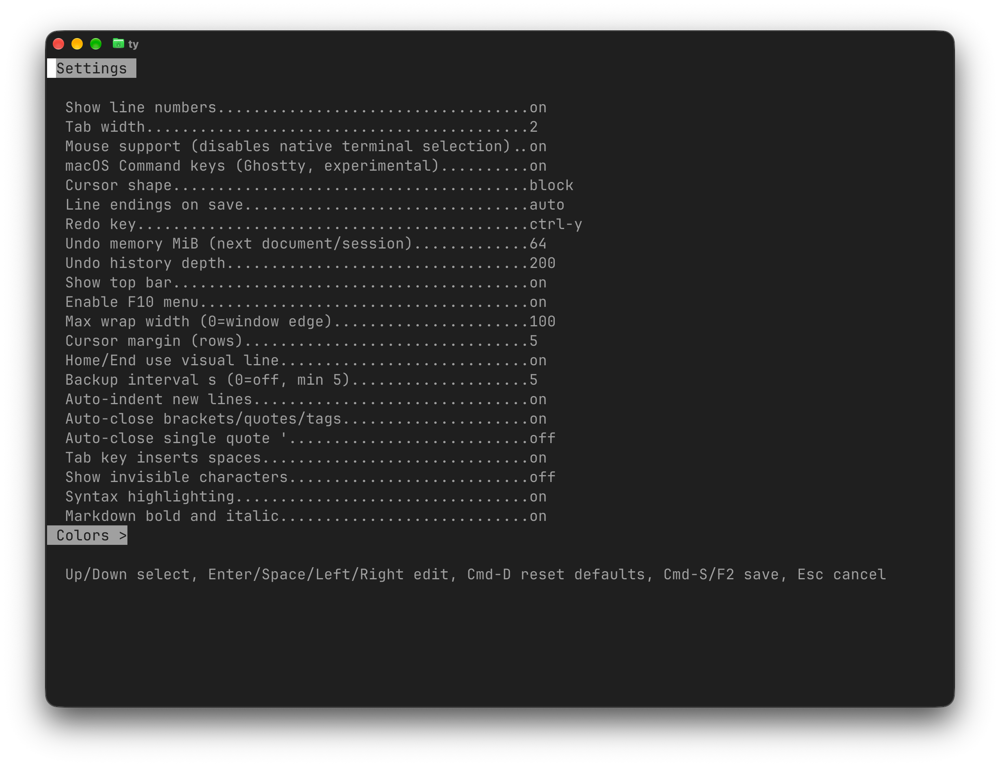
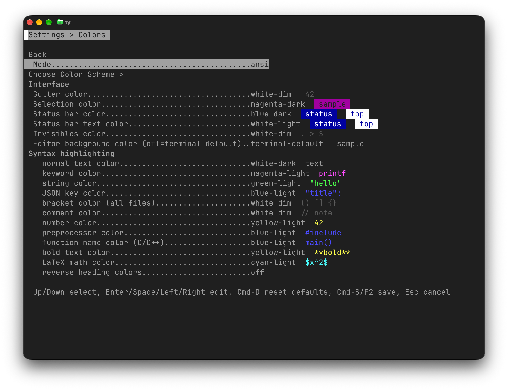
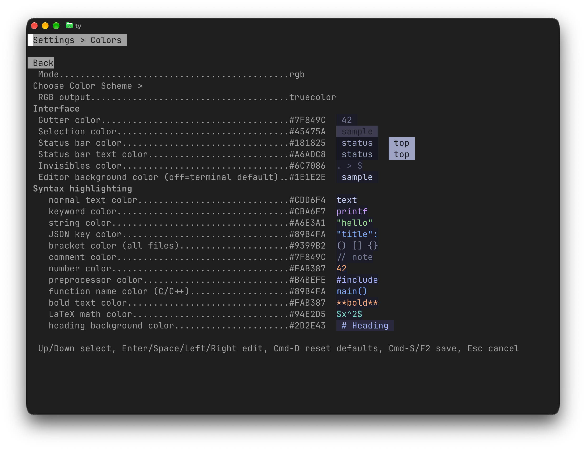
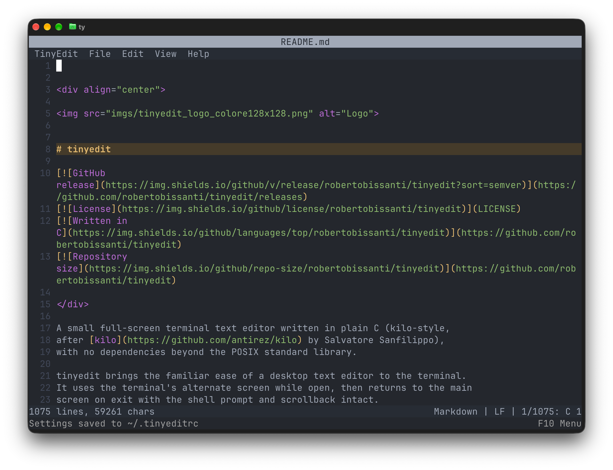
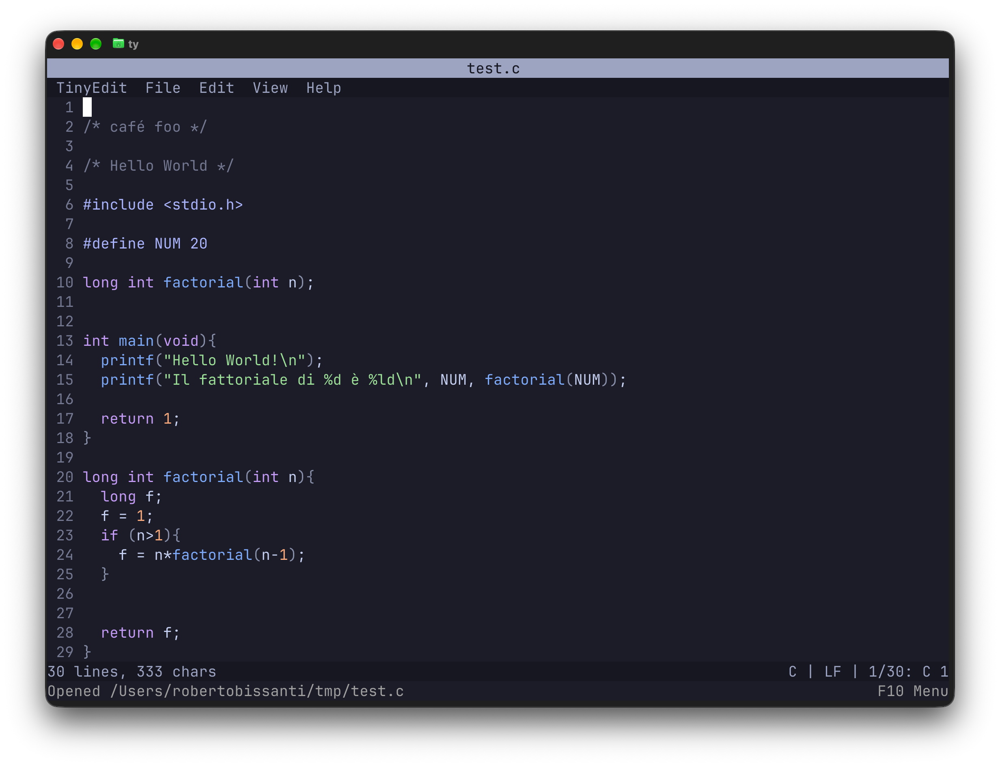

# Settings, colors and themes

[Documentation index](README.md) · [tinyedit overview](../README.md)

## Contents

- [Settings and appearance](#settings-and-appearance)
- [Colors page and RGB](#colors-page-and-rgb)
- [Invisible characters and colors](#invisible-characters-and-colors)

## Settings and appearance

Line numbers (gutter), tab width, interface colors, soft-wrap, the top bar,
cursor shape and blinking, auto-indent, auto-close pairs, tabs-as-spaces,
and invisible characters are configurable from the `F2` panel and saved to
`~/.tinyeditrc`. See the file itself, created automatically on first launch,
for configuration details.
Inside `F2`, `Ctrl-D` resets every setting back to its
default (still needs `Ctrl-S` to actually take effect). Upgrading
tinyedit never requires touching an existing `~/.tinyeditrc`: keys
that aren't in the file (because they were introduced by a newer
version) simply stay at their default until set explicitly.



*The built-in `F2` panel exposes the same options stored in `~/.tinyeditrc`,
including undo depth, wrapping, backup, and mouse support. Colors opens a
separate page sharing the same settings draft.*

**Cursor blinking** is available beside **Cursor shape** in F2 and as a checked
switch in **View**. It is off by default, works with block and bar shapes, and
is saved as `cursor_blink = true` when enabled. The screenshot above predates
this additional row.

## Colors page and RGB

**F2 → Colors** keeps every color setting on one page, grouped into
**Interface** and **Syntax highlighting**. **Mode** selects ANSI or RGB;
**Choose Color Scheme >** sits immediately below it. RGB also exposes
**RGB output** for truecolor or ANSI fallback.

Interface contains the editor background, gutter, selection, invisible
characters and status-bar text/background. Syntax highlighting contains the
same token roles in the same order in both modes, including function names,
Markdown bold/italic text and LaTeX math. ANSI offers **reverse heading colors**;
RGB offers a separate **heading background color**, with heading text using
`rgb_syntax_preprocessor`. Colors remain editable when highlighting is off.



*ANSI uses named colors from the terminal palette, with light, dark and dim
variants and previews for interface elements and syntax tokens.*



*RGB exposes hexadecimal colors and an explicit Markdown heading background.
Labels and navigation retain the terminal's default colors.*

Up/Down selects rows, skipping group headings. Enter/Space edits a value;
Left/Right cycles choices. **Back** or Esc returns to the parent, remembering
its position and retaining the same draft.

Complete presets are included in [`colorschemes/`](../colorschemes/README.md):

| Scheme | RGB file | ANSI file |
|---|---|---|
| One Dark, adapted from Vim One with `background=dark` | `one-dark.conf` | `one-dark-ansi.conf` |
| Catppuccin Mocha | `catppuccin-mocha.conf` | `catppuccin-mocha-ansi.conf` |

RGB presets use explicit colors; ANSI presets are approximations whose actual
shades depend on the terminal palette. One Dark includes the customized
Markdown colors (blue headings, orange-red bold and orange math), with a
coordinated blue-gray heading background (`#354151`); it does not reproduce an
Airline theme or every Vim highlight group.

```sh
make install-colorschemes   # copies missing files; install-colorschemes-force overwrites
```

(equivalent to copying `colorschemes/*.conf` into `~/.tinyedit/color-scheme/`;
`make install-resources` also installs the syntax definitions). `make install`
installs only the binary.

Choose **Mode**, then activate **Choose Color Scheme >** with Enter or Right.
The same row becomes **Choose Color Scheme (use < > to change) name**.
Left/Right previews compatible schemes, Enter applies one to the draft, and
Esc cancels the choice. Invalid presets and presets for the other mode are
excluded. Changing Mode preserves both palettes and changes the available
schemes; it does not automatically apply a theme.

Save Settings to write the confirmed colors to `~/.tinyeditrc`. Discarding
Settings preserves the previous colors. The terminal truecolor/fallback
preference and non-color settings are preserved when applying a scheme.



*One Dark interface and syntax example. This screenshot predates the Vim
Markdown correction: headings now use blue text on blue-gray (`#354151`).*



*Catppuccin Mocha applied to the document, gutter, menu and status bars.*

With mouse support already enabled, click a row to edit/open it and use the
wheel to move through rows. Ctrl-S or F2 saves all draft settings and closes
from any page. Esc at the root offers save/discard/cancel if anything changed.
Ctrl-D resets **all** draft settings, including both palettes; it does not save
immediately or change `filetype.*` overrides. A failed save keeps the panel and
its draft open and leaves live settings unchanged. If replacement succeeded
but directory synchronization failed, the configuration on disk may already
have changed; retry saving to confirm persistence.

The Settings panel always uses the terminal's default text and background.
Only preview samples use draft colors, followed immediately by an attribute
reset, so an unreadable color combination cannot hide navigation or labels.
Samples show the status bar and its explicitly swapped top-bar colors.

ANSI is the default and existing configurations retain their colors, including
legacy names such as `cyan`. RGB uses a separate palette: switching modes
preserves both palettes. In RGB mode, Enter/Space opens a color field: Backspace
edits the current value, Enter accepts a complete `#RRGGBB` or
`terminal-default`, and Esc restores that field. Hex digits accept either case
and save in uppercase. Valid input updates the sample while editing; invalid
input is marked and cannot be accepted.

```ini
color_mode = rgb
rgb_output = truecolor
rgb_background = #222222
rgb_syntax_normal = #E0E0E0
rgb_syntax_keyword = #80A0FF
rgb_statusbar = #303030
rgb_statusbar_text = #FFFFFF
# The ANSI palette is retained independently:
color_background = terminal-default
color_syntax_keyword = blue-light
```

Every `color_<name>` palette key has a corresponding `rgb_<name>` key.
`color_mode` and `rgb_output` select behavior rather than colors.
A leading `#` starts a comment, except at the start of an RGB color value;
trailing comments after a value are supported. In `filetype.<ext>` labels a
`#` only starts a comment when preceded by whitespace, so `filetype.cs = C#`
keeps its label. Invalid values keep the
previous value (or default); absent keys use defaults. `terminal-default`
means the terminal's own foreground or background in either mode. Explicit RGB
values emit 24-bit foreground/background escapes and do not use its palette.

True color support is selected manually: **truecolor** emits RGB;
**ansi-fallback** approximates each RGB value with the nearest of sixteen ANSI
reference colors. The terminal still controls those ANSI colors, so the fallback
cannot promise exact RGB appearance. No support is inferred from `TERM` or
other environment variables, and there are no terminal capability queries.
Choose fallback or ANSI for terminals or SSH/multiplexer paths without RGB;
forcing truecolor there may render incorrectly or be ignored.

RGB defaults are fixed references, independent of the terminal: gray `#808080`,
blue `#5555FF`, green `#55FF55`, yellow `#FFFF55`, cyan `#55FFFF`, magenta
`#FF55FF`, red `#FF5555`, white `#FFFFFF`; normal-intensity white is `#AAAAAA`
and dim gray `#404040`. Default background and normal text remain
`terminal-default`. The default RGB roles follow the existing ANSI default
roles using those references. ANSI light/dark/dim choices remain exclusive to
ANSI; RGB colors have no implicit intensity variants. ANSI dim backgrounds
continue to use their dark counterparts. RGB fallback excludes dim variants.

## Invisible characters and colors

With `show_invisibles` on (off by default), spaces and tabs render as
dedicated glyphs (`.` for space, `>` for tab) and every line ending
shows a `$`, all in the color set by `color_invisibles` (same palette
as the gutter/selection/status bar, gray by default).

Gutter, selection, status bar, and invisibles colors are all picked
from a palette of 24 (each of the 8 base hues, gray, blue, green,
yellow, cyan, magenta, red, and white, in three variants: light `-light`,
dark `-dark`, and dim `-dim`, e.g. `cyan-dim`), always plain ANSI
codes in the default ANSI mode (`-dim` support is somewhat less
consistent across terminals; some render it identically to `-dark`
instead of actually dimming it, but it is still base ANSI). In the
`F2` panel, Left/Right cycle the selected color back/forward (in
addition to Enter/Space, which only advances). This is handy for jumping back
a step without scrolling through the whole palette. `~/.tinyeditrc`
files written by older versions (unsuffixed names, e.g. `color_gutter
= cyan`) are recognized automatically on load and mapped to the
corresponding `-light` variant (the one the old palette actually
rendered), without losing the customization.

Every color row in the `F2` panel shows a live swatch of its value next
to the name, so you can preview the selection without leaving the panel.

`color_background` paints the whole editor area: rows, gutter, and the
empty space below the text. It defaults to `terminal-default`, which
emits no background escape at all and leaves the terminal's own
background untouched. Its `-dim` variants are skipped while cycling:
the dim attribute only applies to foreground text, so as a background
each would be indistinguishable from its `-dark` twin. Note that
`gray-dark`/`gray-dim` are plain black in this palette (the ANSI hue
named "gray" is black at normal intensity), so they look like no
background at all on a terminal whose own background is already dark.
The editor resets its visual terminal state on exit, so a selected
background does not remain active in the shell.

`cursor_blink = true` enables cursor blinking for either shape (default: false).
Toggle **Cursor blinking** in F2 or the View menu; the terminal must support
DECSCUSR blinking styles. Exit restores the terminal cursor default.

`cursor_style` selects `block` (the default) or `bar` (I-beam). It uses
the standard DECSCUSR terminal escape sequence; terminals without that
extension keep their normal cursor shape.

`line_ending` controls the format written on save: `auto` (default)
preserves the first line-ending style detected when opening the file,
while `lf` and `crlf` force conversion to that format. The status bar shows
the effective style as `LF` or `CRLF`; a trailing `*` means the input
file contained a mix of both styles, and auto will use the first one.

When the settings list doesn't fit the screen, a column on the left
(like the line-number gutter) shows `^` on the first visible entry if
there are more above, and `v` on the last one if there are more below.

Markdown italic text has its own **Italic text color** row in Colors:
`color_syntax_italic` (ANSI) / `rgb_syntax_italic` (RGB). One Dark RGB uses
`#D19A67`. Older configurations without these keys retain the keyword color.
